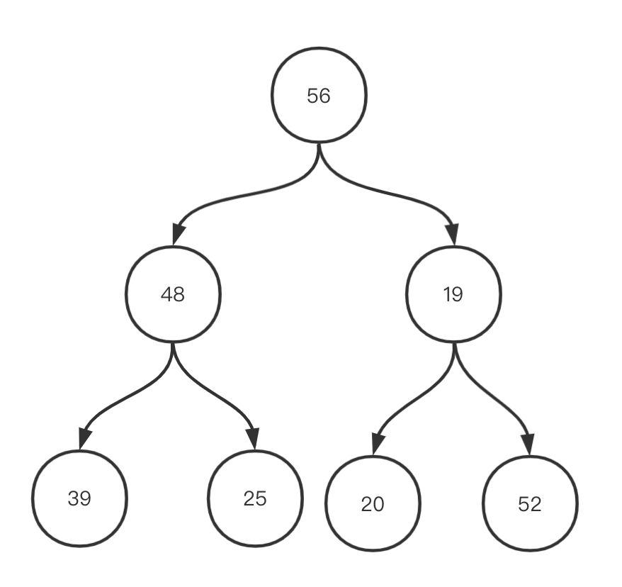
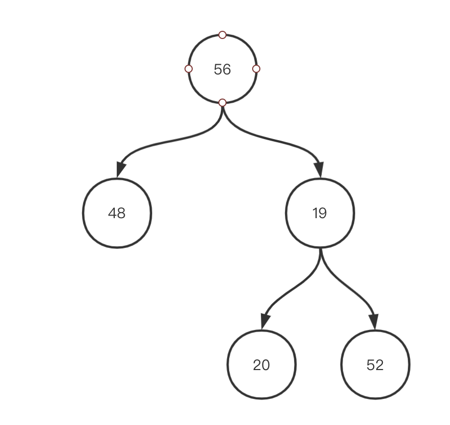
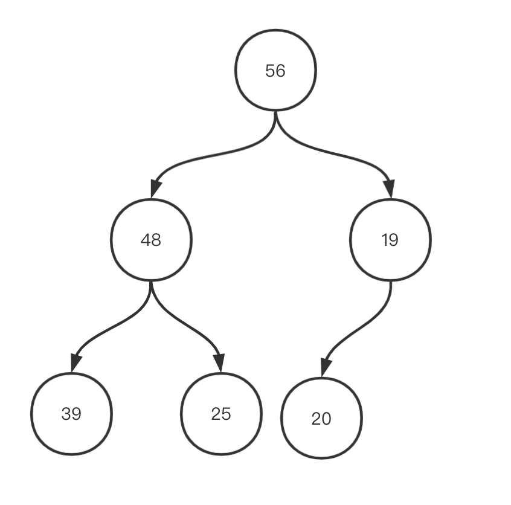
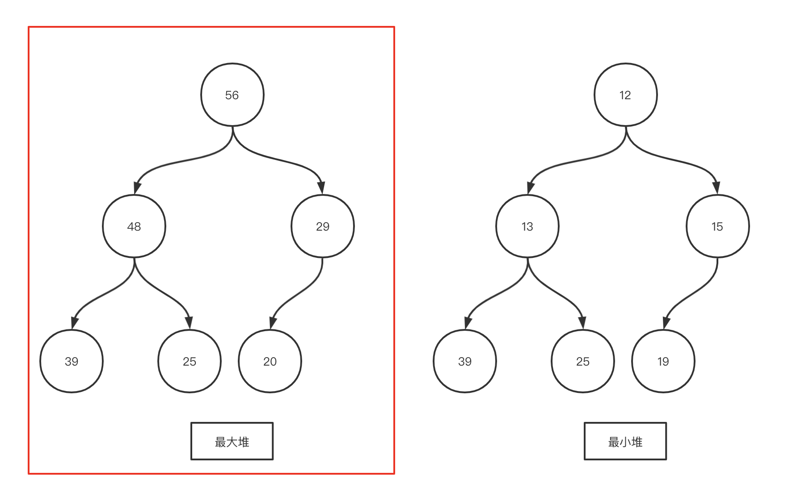
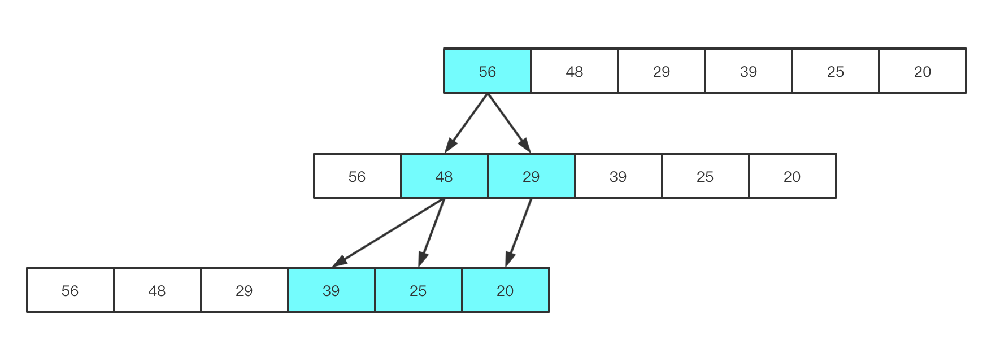

# 优先队列和堆

作者： Lrc123    审核: liweiwei1419

## 什么是优先队列？

「普通队列」的特点是：先进先出，后进后出。「优先队列」是一种特殊的「队列」，入队与普通队列无异，在出队的时候按照「优先级顺序」出队。这里的「优先级顺序」可以是人为定义的。「优先队列」可以使用数组实现，或者是维护有序数组，或者是在出队的时候，线性扫描找到优先级最高的元素，但是只要是「线性结构」，最差情况下都得扫描数组一遍。

## 为什么使用优先队列？

这里要引出优先队列的一个特点:「动态」。如果应用场景是不需要有动态地添加和取出元素的话，我们只需要对容器进行一次性的排序就足以解决问题。比如对班级学生绩点进行从大到小依次输出，快速排序这样的排序算法效率要比使用优先队列来说要高得多。但是如果对手游王者荣耀中攻击范围内血量最低的敌人进行进攻的优先级排序，则需要使用到优先队列。因为攻击范围内的敌人数量是在不断变化的。如果要对变化中的容器每次都做整体的排序，效率是很低的（$N$次调用是$N^2logN$）。我们这里要讨论的是由「堆」这种数据结构所实现的优先队列，它的效率会要比排序法高上许多($N$次调用是$NlogN$)。

## 什么是堆?

为了避免「线性扫描」，需将数据组织成「树形结构」。二叉堆就是一种高效的「优先队列」实现。另外，还有二项式堆，最大-最小堆、斐波拉契堆等实现，针对普通的算法面试可以不用掌握。

二叉堆满足，从最大堆每次取出的堆顶元素是该堆中的最大元素，从最小堆每次取出的堆顶元素是该堆中的最小元素。在最大堆中，每一个父节点都是大于等于它的孩子节。同理，最小堆则是父节点要小于等于孩子节点。

## 二叉堆

说到「二叉堆」，正如它名字所表示，它是一个使用二叉树来实现的数据结构。二叉树因其结构又有多种专有名词，我们这里对三种形态的二叉树做一个区分帮助大家理解。

### 满二叉树 Full BinaryTree
在国内普遍使用的教材《数据结构 c语言版》中，满二叉树的定义是：「
一棵深度为$k$且有$2^k - 1$个结点的二叉树称为满二叉树。」
那么它应该长这样：

但是，根据wiki等外文信息网站的描述：

满二叉树的定义则是：「叶子节点的数量是非叶子节点数量+1的二叉树。」如上图，所以，当被问什么是满二叉树时。可以根据要求和语境作答。

### 完全二叉树 Complete BinaryTree
完全二叉树的定义是：「除了最后一层不一定是满的，完全二叉树的每一层结点都是满的。且最后一层的结点是从左至右依次排列。当最后一层也是满的时候，也称作完美二叉树」。

### 完美二叉树 Perfect BinaryTree
根据wiki上的解释：「完美二叉树是所有非叶子结点都有左右两个孩子的二叉树」，又可以理解成最后一层是满的的完全二叉树，所以又可以说完美二叉树是特殊的完全二叉树。

后面我们只会用到完全二叉树，完全二叉树的定义以上文为准。

### 二叉堆图解

>「二叉堆（Binary Heap）是一个可以被看成近似完全二叉树的数组。树上的每一个结点对应数组的一个元素。除了最底层外，该树是完全充满的，而且是从左到右填充。」  
—— 《算法导论》

上面这段引用什么意思呢，用一句话概括就是：`二叉堆在逻辑上是一颗完全二叉树，在实现上是普通的一维数组。`

我们用两幅图直观地感受一下「二叉堆」:

图1. 最大堆和最小堆

图2. 实现上的一维数组

图3. 直观表示

## 堆常见的操作：

HEAPPOP：弹出堆顶元素，并调整堆，替代到堆顶位置，时间复杂度为 $O(\log N)$。

HEAPPUSH：向数组末尾加入新的元素，并调整到正确的位置，维持堆的结构，时间复杂度为 $O(\log N)$。

HEAPIFY 建堆：把一个无序的数组变成堆结构的数组，时间复杂度为$O(N\log N)$。如果说HEAPPOP是动态地创建一个堆，那么HEAPIFY则是将一个数组一次转化成堆。具体的方法我们放在后面讲。

HEAPSORT：HEAPFY 维持堆的结构，通过HEAPPOP，每次将最堆顶元素排列到堆尾，size减小。重复操作直到数组绝对有序，时间复杂度为$O(N\log N)$。空间复杂度为 $O(1)$。

## 学习建议
+ 我们可以先通过手动实现一个堆的数据结构来认识堆。
+ 当我们遇到题目中有优先级、大小关系或排序等字眼的时候，我们就可以想到堆这个数据结构，并尝试应用它。  

# 堆的应用和刷题常见问题
+ 堆与优先队列  
    堆与优先队列这个标题常常一起出现，实际上堆就是优先队列的一种实现方式。
    我们在实例化优先队列的时候，也常常将实例名称写为maxHeap和minHeap。  
+ 如果数据有动态更新的特点，可以使用「优先队列」（堆）。
+ `注意：这里的堆指的是一种数据结构，不是操作系统里的堆。`
