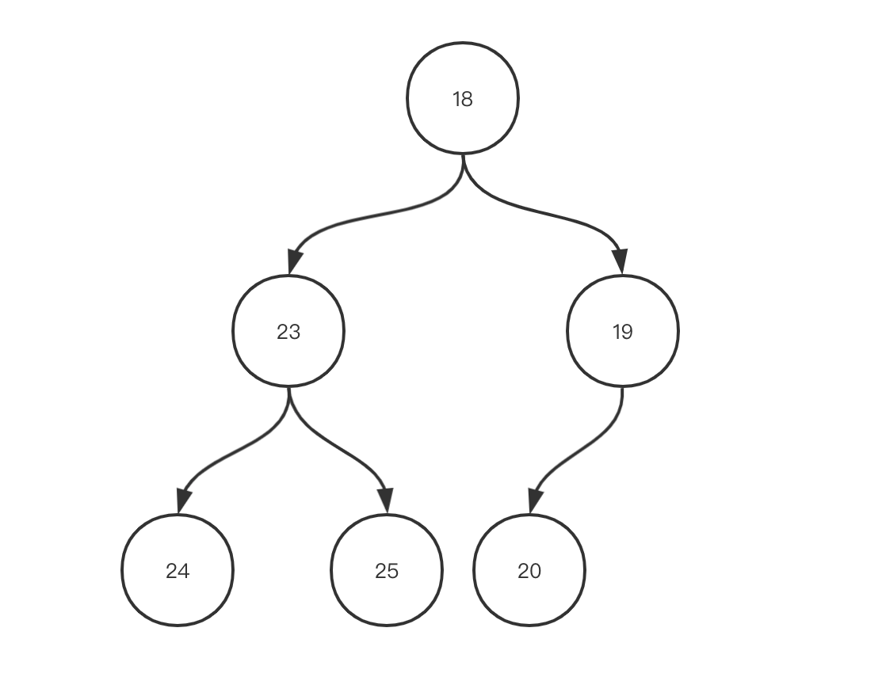
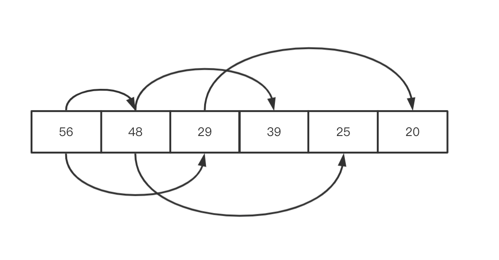

# 堆数据结构和相关算法应用

作者： Lrc123    审核:

## 什么是堆?

堆的性质其实很简单，将堆看作一棵树，那么该树总满足父节点的值大于其子节点(最大堆)；同理，最小堆是其父节点的值总小于其子节点。

如此一来，从最大堆每次取出的堆顶元素是该堆中的最大元素，从最小堆每次取出的堆顶元素是该堆中的最小元素。

## 二叉堆
>「二叉堆（Binary Heap）是一个可以被看成近似完全二叉树的数组。树上的每一个结点对应数组的一个元素。除了最底层外，该树是完全充满的，而且是从左到右填充。」  
—— 《算法导论》

上面这段引用什么意思呢，用一句话概括就是：`二叉堆在逻辑上是一颗完全二叉树，在实现上是普通的一维数组。`

我们用两幅图直观地感受一下:

图1. 逻辑上的二叉树

图2. 实现上的一维数组

## 堆常见的操作：

HEAPIFY 建堆：把一个无序的数组变成堆结构的数组，时间复杂度为$O(N\log N)$。

HEAPPUSH：向数组末尾加入新的元素，并调整到正确的位置，维持堆的结构，时间复杂度为 $O(\log N)$。

HEAPPOP：弹出堆顶元素，并调整堆，替代到堆顶位置，时间复杂度为 $O(\log N)$。

HEAPSORT：HEAPFY 维持堆的结构，通过HEAPPOP，每次将最堆顶元素排列到堆尾，size减小。重复操作直到数组绝对有序，时间复杂度为$O(N\log N)$。空间复杂度为 $O(1)$。

## 学习建议
+ 我们可以先通过手动实现一个堆的数据结构来认识堆。
+ 当我们遇到题目中有优先级、大小关系或排序等字眼的时候，我们就可以想到堆这个数据结构，并尝试应用它。  

# 堆的应用和刷题常见问题
+ 堆与优先队列  
    堆与优先队列这个标题常常一起出现，实际上堆就是优先队列的一种实现方式。
    我们在实例化优先队列的时候，也常常将实例名称写为maxHeap和minHeap。  
+ `注意：这里的堆指的是一种数据结构，不是操作系统里的堆。`

