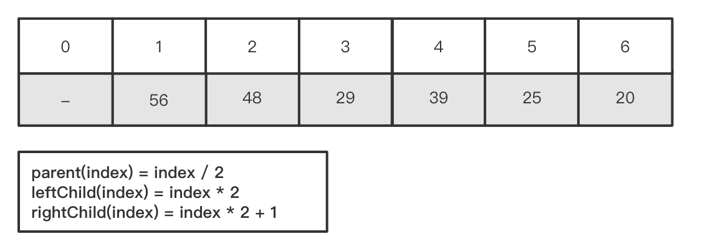
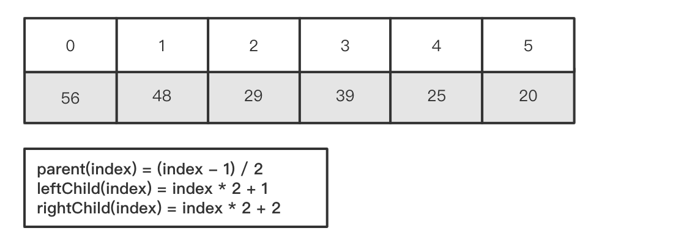
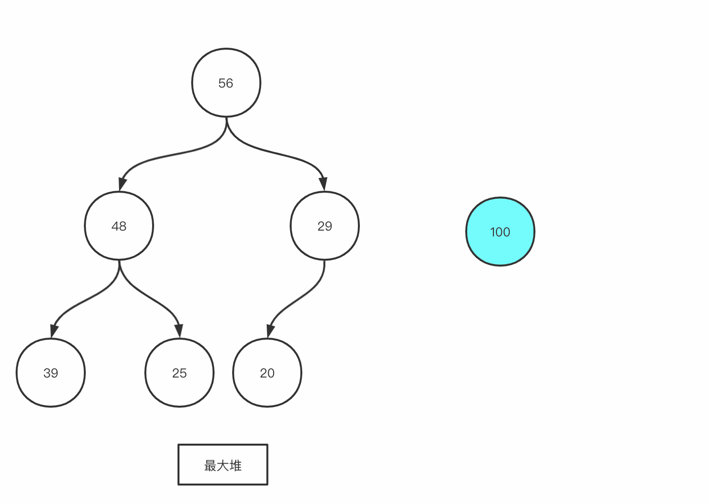
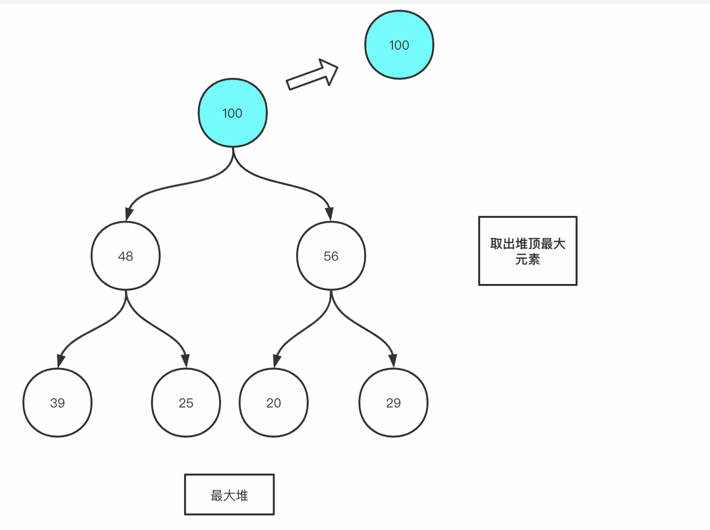

# 堆的实现和堆排序

多数情况下，我们可以直接使用库函数中提供的优先队列实现。
+ Java：`PriorityQueue`
+ C++：`priority_queue`
+ Python：`heap` 或者 `from queue import PriorityQueue`  

不过，在学习堆这个数据结构的时候，手动实现堆，可以帮助我们更好地理解和使用它。

### 堆的实现

### 1. 数组中元素的逻辑关系
#### 1. 从1开始的数组实现
我们以「最大堆」为例，介绍堆的工作原理，「最小堆」的工作原理类似，留给读者完成。
由于底层实现是数组，为了简便起见，我们的实现不考虑数组扩容的情况，如果要支持「动态扩容」，请在网上搜索「动态数组」的相关资料；
用来实现堆的数组排列方式其实是有两种方案的。
假如我们要从任意一个结点出发找到它的父结点或左右孩子结点：
从数组1这个位置开始，当前结点与父子结点会有如下的关系：


<!-- tabs:start -->
#### **Java**  
```java
// 通过当前位置求父结点位置
public int parent(int index) {
    return data[index / 2];
}

// 通过当前位置求左孩子结点位置
public int leftChild(int index) {
    return data[index * 2];
}

// 通过当前位置求右孩子结点位置
public int rightChild(int index) {
    return data[index * 2 + 1];
}

```
<!-- tabs:end -->

#### 2. 从0开始的数组实现
从位置1开始直接好懂，不过会浪费 0 号位置这一个空间。我们仔细思考一下，发现从 0 位置开始也可以实现父子结点的对应关系。即，假设求父结点位置，我们先将 index 向左移动一位，即减一，然后再除以二。即可得到父结点位置。若求左孩子位置，则可以直接通过逆推求父结点的表达式得到，右孩子的位置则是左孩子位置加一。这里读者可以通过数学推导或者编写测试代码自行验证，帮助理解。


<!-- tabs:start -->
#### **Java**
```java
// 通过当前位置求父结点位置
public int parent(int index) {
    return data[(index - 1) / 2];
}

// 通过当前位置求左孩子结点位置
public int leftChild(int index) {
    return data[index * 2 + 1];
}

// 通过当前位置求右孩子结点位置
public int rightChild(int index) {
    return data[index * 2 + 2];
}

```
<!-- tabs:end -->

### 2. 向堆中添加元素和SiftUp

`SiftUp`操作是为了向堆中添加元素，和直接对数组`heapify`(将一个数组堆化)不同的是，`SiftUp`用于动态地构造一个堆。将从数组尾部添加的新元素给移动到正确的位置。

+ 先从数组尾部添加新元素，再将该元素移动到正确的位置。而这个移动的过程就叫做`SiftUp`。
+ `SiftUp`通过与父结点比较，如果比父结点大则交换。同时不要忘记交换后结点位置也要更新为原父结点的位置。



<!-- tabs:start -->
#### **Java**
```java

// 向堆中添加元素
public void add(int num) {
    data[size] = num;
    siftUp(size);
    size++;
}

// siftup操作
public void siftUp(int index) {
    while (index <= size && parent(index) >= 0) {
        if (data[index] > data[parent(index)]) {
            swap(index, parent(index));
            index = parent(index);
        } else {
            break;
        }
    }
}

```

### 思考 
为什么我们要以`SiftUp`这样的方式来添加元素呢？

这里可以这样捋一下思路：首先，我们知道原本数组中元素排列的逻辑是堆，当添加进一个新的元素进来的时候，这个新元素毫无疑问是有可能会破坏我们原有堆结构的顺序关系的。那么，如何以最有效率的方式使新数组重新有序呢，通过观察可以看到，从数组末尾添加进的元素，它其实只和它的父结点有一个大小顺序要求的。假如较大的新元素恰好在左孩子位置上，它只需要和父亲结点交换就行了。通过从下至上每一次和父结点比较，可以很快地调整好堆的顺序（这个过程有点像冒泡排序，每次把元素通过多次比较交换放到正确位置上）。假如元素恰好在右孩子的位置上，由于原来的数组，父结点一定大于孩子结点（包括左孩子），所以，右孩子不需要和左孩子比较，也是直接和父结点交换即可。

<!-- tabs:end -->

### 3. 从堆中取出元素和SiftDown


<!-- tabs:start -->
#### **Java**

```java

// 取出数组顶部元素，然后将数组末尾元素填充到堆顶，数组size减一，在将堆顶元素siftdown
public int extractMax() {
    int ret = data[0];
    data[0] = data[size - 1];
    size--;
    siftDown(0);
    return ret;
}

// siftdown j代表孩子结点中较大那个的位置
public void siftDown(int index) {
    while (leftChild(index) < data.size()) {
        int j = leftChild(index);
        if (j + 1 < data.size() && data.get(j + 1) > data.get(j)) {
            j++;
        }
        if (data.get(index) > data.get(j)) {
            return;
        }
        swap(data, index, j);
        index = j;
    }
}

```

### 思考
`SiftDown`这个操作也是非常有意思，为什么要把数组末尾的元素放到堆顶呢？

我们可以分析一下，当堆顶元素被取走时，堆顶位置肯定就空缺了。那么怎么填补这个空缺，使数组重新有序呢？很自然会先想到从堆顶的左右孩子中选择，然后依此循环直到有序。乍一想好像「计划通」。然而通过些许的验证，其实就能发现问题，我们先想象一下堆作为二叉树的样子，假设这个替换过程结束的时候，是把二叉树最后一层的左边某个结点给替换了，而右边的结点还在。这棵二叉树就不再是完全二叉树。从数组上也可以发现空缺的元素将不会是在末尾，而是在数组之中的某个位置。我们回过头看看我们的`add`操作其实就是通过不断在数组末尾添加元素来实现的。空缺在数组中间的话，是没有办法填补的。所以，这种调整方法会破坏堆的结构，是不可行的。而`SiftDown`把数组末尾的元素直接放到堆顶就是一个非常巧妙的做法，因为，`extractMax`这个弹出操作，必然会使堆中元素减少，那么我们就直接把末尾的元素给移动到空缺使数组减小，堆会继续调整，但绝不会再影响（使用）到末尾这个位置了，内部的排列自然不会有空缺。试想，从数组中任何一个其他的位置，抽出元素来填补堆顶，都没办法做到这样。所以`SiftDown`操作是非常合理的。


<!-- tabs:end -->

#### 完整代码

<!-- tabs:start -->
```java
public class Heap {

    int[] data;
    int size;

    public Heap(int capacity) {
        data = new int[capacity];
        size = 0;
    }

    public int parent(int index) {
        return (index - 1) / 2;
    }

    public int leftChild(int index) {
        return index * 2 + 1;
    }

    public int rightChild(int index) {
        return index * 2 + 2;
    }

    public int getSize() {
        return size;
    }

    public void swap(int i, int j) {
        int tmp = data[i];
        data[i] = data[j];
        data[j] = tmp;
    }

    public void add(int num) {
        data[size] = num;
        siftUp(size);
        size++;
    }

    public int extractMax() {
        int ret = data[0];
        data[0] = data[size - 1];
        size--;
        siftDown(0);
        return ret;
    }


    public void siftUp(int index) {
        while (index < size && parent(index) >= 0) {
            if (data[index] > data[parent(index)]) {
                swap(index, parent(index));
                index = parent(index);
            } else {
                break;
            }
        }
    }

    public void siftDown(int index) {
        while (index < size && leftChild(index) <= size) {
            int j = leftChild(index);
            if (j + 1 <= size && data[j] < data[j + 1]) {
                j++;
            }
            if (data[j] <= data[index]) {
                return;
            }
            swap(j, index);
            index = j;
        }
    }

    public void printHeap() {
        StringBuilder sb = new StringBuilder();
        sb.append("[");
        for (int i = 0; i < size; i++) {
            if (i != size - 1) {
                sb.append(data[i]).append(",");
            } else {
                sb.append(data[i]).append("]");
            }
        }
        System.out.println(sb.toString());
    }

//    public static void main(String[] args) {
//        Heap heap = new Heap(10);
//        heap.add(11);
//        heap.add(2);
//        heap.add(10);
//        heap.add(5);
//        heap.add(3);
//        heap.printHeap();
//        System.out.println(heap.extractMax());
//        System.out.println(heap.extractMax());
//        System.out.println(heap.extractMax());
//        System.out.println(heap.extractMax());
//    }

}

```
<!-- tabs:end -->


## 堆排序

+ 其实有了「堆」就可以借助它进行排序，但是我们可以直接把「原始数组」构建成「堆」（这个操作称之为 heapify），这样的排序方法称之为「堆排序」。（区别于使用一个额外的堆。）

<!-- tabs:start -->
#### **Java**

```java
public class Solution {

    // heapsort是一种in-place排序，就是直接对原数组进行位置上的交换来排序
    public void heapSort(int[] nums) {
        int size = nums.length - 1;
        // 先对数组进行最大堆化
        heapify(nums, size);
        // 然后每次将堆顶的最大元素移动到数组末尾，将交换至堆顶的较小元素再进行下沉操作，使数组再次堆化有序。使size减一，堆化的操作将不影响末尾已经排序好的元素。重复操作直到堆中元素都按照从大到小，从后往前的方式排列在原数组上。
        while (size > 0) {
            swap(nums, 0, size);
            siftDown(nums, 0, size);
            size--;
        }
    }

    //堆化，从末尾开始将较小元素下沉
    public void heapify(int[] nums, int size) {
        for (int i = parent(size); i > 0; i--) {
            siftDown(nums, i, size);
        }
    }

    //下沉操作
    public void siftDown(int[] nums, int index, int size) {
        while (leftChild(index) < size) {
            // 这里声明的j变量是用来选择当前结点的两个左右孩子的较大结点
            int j = leftChild(index);
            if (j + 1 < size && nums[j + 1] > nums[j]) {
                j++;
            }
            // 如果两个孩子结点的较大值都比当前结点小，则不需要继续swap，直接return
            if (nums[index] > nums[j]) {
                return;
            }
            // 如果较大的那个比当前结点大，则交换
            swap(nums, index, j);
            // 当前结点的index也要移动到被交换的孩子结点上，为下一次比较做准备
            index = j;
        }
    }

    // 对原数组进行操作，交换两个位置的变量
    public void swap(int[] nums, int i, int j) {
        int tmp = nums[i];
        nums[i] = nums[j];
        nums[j] = tmp;
    }

    // 输入当前结点的位置，计算得到父结点的位置
    public int parent(int index) {
        return (index - 1) / 2;
    }

    // 计算左孩子结点的位置
    public int leftChild(int index) {
        return index * 2 + 1;
    }

    // 计算右孩子结点的位置
    public int rightChild(int index) {
        return index * 2 + 2;
    }
}

```

<!-- tabs:end -->

**复杂度分析**：

+ 时间复杂度：$O(N\log N)$，这里 $N$ 是数组的长度，每次抽取出堆顶为 $O(\log N)$ ， $N$ 个元素就 $N$ 次操作。
+ 空间复杂度：$O(1)$。 in-place 排序，不需要额外空间。