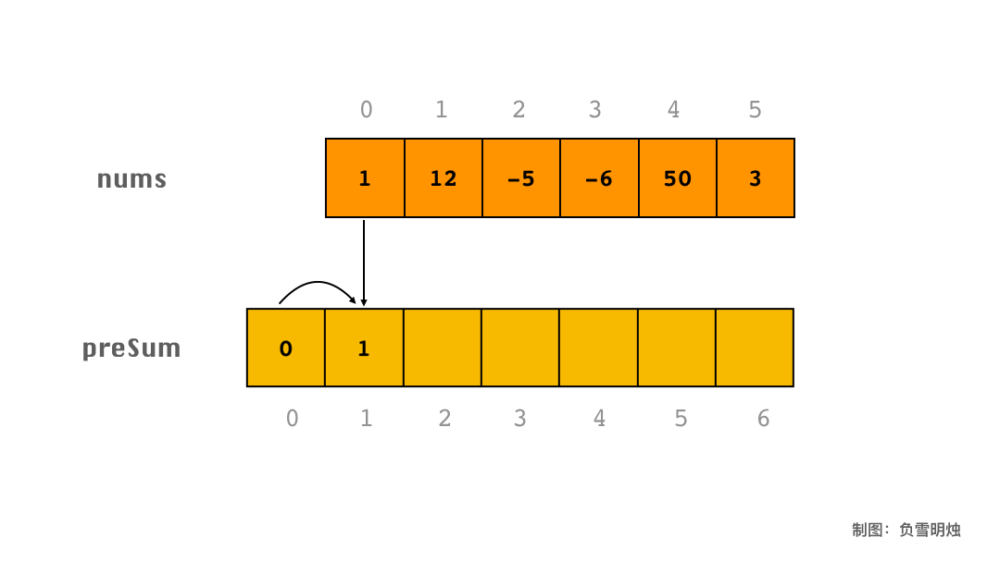

# 滑动窗口模板二

为了省去模板一代码中  `if (i == 0)` 判断，我们常常把「前缀和」数组 **`preSum ` 的长度定义为 **`原数组的长度 + 1`。`preSum` 的第 0 个位置，相当于一个占位符，置为 0。
**那么就可以把 `preSum`** 的公式统一为 **`preSum[i] = preSum[i - 1] + nums[i - 1]`，**此时的 **`preSum[i]`** 表示 **`nums`**中 $i$ 元素左边所有元素之和（不包含当前元素 $i$）。

下面以 `[1, 12, -5, -6, 50, 3]` 为例，用动图讲解一下如何求 `preSum`。



求 `preSum` 数组的过程是——

```c++
preSum[0] = 0;
preSum[1] = preSum[0] + nums[0];
preSum[2] = preSum[1] + nums[1];
...
```


对应的代码如下：


```cpp
vector<int> runningSum(vector<int>& nums) {
    const int N = nums.size();
    vector<int> preSum(N + 1, 0);
    for (int i = 0; i < N; ++i) {
        preSum[i + 1] = preSum[i] + nums[i]; 
    }
    return preSum;
}
```

注意，上面的代码中没有给 `preSum[0]` 赋值，在 C++ 中 vector<int> 的默认值为 0。

- 时间复杂度：$O(N)$;

- 空间复杂度：$O(N)$。

