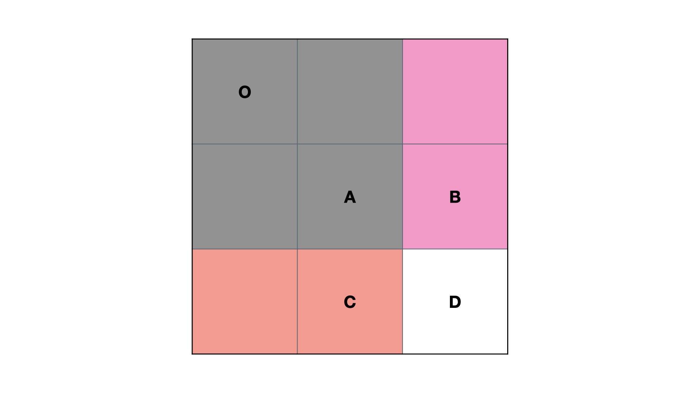
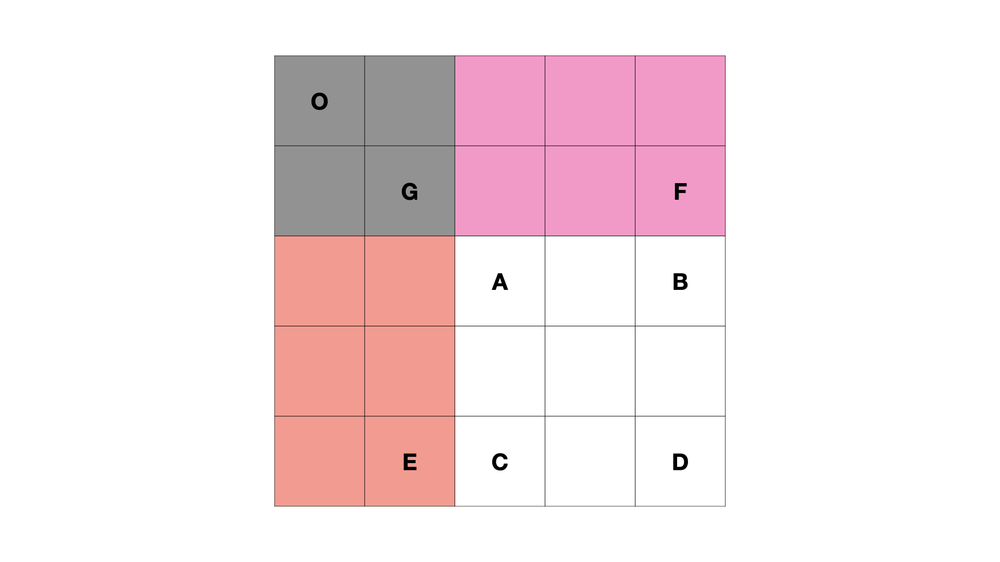

# 拓展
## 拓展一：隐藏的「前缀和」

例题 1.「力扣」的 [643. 子数组最大平均数 I](https://leetcode-cn.com/problems/maximum-average-subarray-i/) 。

> 给你一个由 `n` 个元素组成的整数数组 `nums` 和一个整数 `k` 。
>
> 请你找出平均数最大且 长度为 `k` 的连续子数组，并输出该最大平均数。
>
> 任何误差小于 $10^-5$ 的答案都将被视为正确答案。
>
>  
>
> 示例 1：
>
> 输入：nums = [1,12,-5,-6,50,3], k = 4
> 输出：12.75
> 解释：最大平均数 (12-5-6+50)/4 = 51/4 = 12.75

这个题目要求数组 `nums` 中所有长度为 `k` 的连续子数组中的最大的平均数。

可以用「**前缀和**」来解决，也可以用固定大小为 k 的「**滑动窗口**」来解决。

要求大小为 `k` 的窗口内的最大平均数，可以求 $[i, i + k]$ 区间的「最大和」再除以 k，即求 `(preSum[i + k] - preSum[i]) / k` 的最大值。

于是，「最大平均数」问题被转换成了「最大区间和」问题，然后使用「前缀和」解决。

## 拓展二：二维矩阵的「前缀和」
另外一种拓展，是求二维矩阵的「前缀和」。

例题 2. 「力扣」的 [304. 二维区域和检索 - 矩阵不可变](https://leetcode-cn.com/problems/range-sum-query-2d-immutable/)。

> 给定一个二维矩阵 `matrix`，以下类型的多个请求：
>
> 计算其子矩形范围内元素的总和，该子矩阵的 **左上角** 为 `(row1, col1)`，右下角 为 `(row2, col2)` 。
> 实现 `NumMatrix` 类：
>
> - `NumMatrix(int[][] matrix)` 给定整数矩阵 `matrix` 进行初始化
> - `int sumRegion(int row1, int col1, int row2, int col2)` 返回 左上角 `(row1, col1)` 、右下角 `(row2, col2)` 所描述的子矩阵的元素 总和 。
>
>
> 示例 1：
>
> 
>
> 输入: 
> 	["NumMatrix","sumRegion","sumRegion","sumRegion"]
> 	[[[[3,0,1,4,2],[5,6,3,2,1],[1,2,0,1,5],[4,1,0,1,7],[1,0,3,0,5]]],[2,1,4,3],[1,1,2,2],[1,2,2,4]]
> 输出: 
> 	[null, 8, 11, 12]
>
> 解释:
> 	NumMatrix numMatrix = new NumMatrix([[3,0,1,4,2],[5,6,3,2,1],[1,2,0,1,5],[4,1,0,1,7],[1,0,3,0,5]]]);
> 	numMatrix.sumRegion(2, 1, 4, 3); // return 8 (红色矩形框的元素总和)
> 	numMatrix.sumRegion(1, 1, 2, 2); // return 11 (绿色矩形框的元素总和)
> 	numMatrix.sumRegion(1, 2, 2, 4); // return 12 (蓝色矩形框的元素总和)

当「前缀和」拓展到二维区间时，可以用下面的思路求解。

### 步骤一：求 preSum


我们定义 `preSum[i][j]` 表示 从 `[0,0]` 位置到 `[i,j]` 位置的子矩形所有元素之和。


如果求 `preSum[i][j]` 的递推公式为：


$preSum[i][j] = preSum[i - 1][j] + preSum[i][j - 1] - preSum[i - 1][j - 1] + matrix[i][j]$


可以用下图帮助理解：


$S(O, D) = S(O, C) + S(O, B) - S(O, A) + D$


减去 $S(O, A)$ 的原因是 $S(O, C)$ 和 $S(O, B)$ 中都有 $S(O, A)$，即加了两次 $S(O, A)$，所以需要减去一次 $S(O, A)$。


### 步骤二：根据 preSum 求子矩形面积
前面已经求出了数组中从 `[0,0]` 位置到 `[i,j]` 位置的 `preSum`。


可以用 `preSum` 计算 `[row1, col1]` 到 `[row2, col2]` 的子矩形的所有元素之和：


$preSum[row2][col2] - preSum[row2][col1 - 1] - preSum[row1 - 1][col2] + preSum[row1 - 1][col1 - 1]$ 


同样利用一张图来说明：


$S(A, D) = S(O, D) - S(O, E) - S(O, F) + S(O, G)$



加上子矩形 $S(O, G)$ 面积的原因是 $S(O, E)$ 和 $S(O, F)$ 中都有 $S(O, G)$，即减了两次 $S(O, G)$，所以需要加上一次 $S(O, G)$。


代码如下：

```python
class NumMatrix:

    def __init__(self, matrix: List[List[int]]):
        if not matrix or not matrix[0]:
            M, N = 0, 0
        else:
            M, N = len(matrix), len(matrix[0])
        self.preSum = [[0] * (N + 1) for _ in range(M + 1)]
        for i in range(M):
            for j in range(N):
                self.preSum[i + 1][j + 1] = self.preSum[i][j + 1] + self.preSum[i + 1][j]  - self.preSum[i][j] + matrix[i][j]


    def sumRegion(self, row1: int, col1: int, row2: int, col2: int) -> int:
        return self.preSum[row2 + 1][col2 + 1] - self.preSum[row2 + 1][col1] - self.preSum[row1][col2 + 1] + self.preSum[row1][col1]


# Your NumMatrix object will be instantiated and called as such:
# obj = NumMatrix(matrix)
# param_1 = obj.sumRegion(row1,col1,row2,col2)
```

