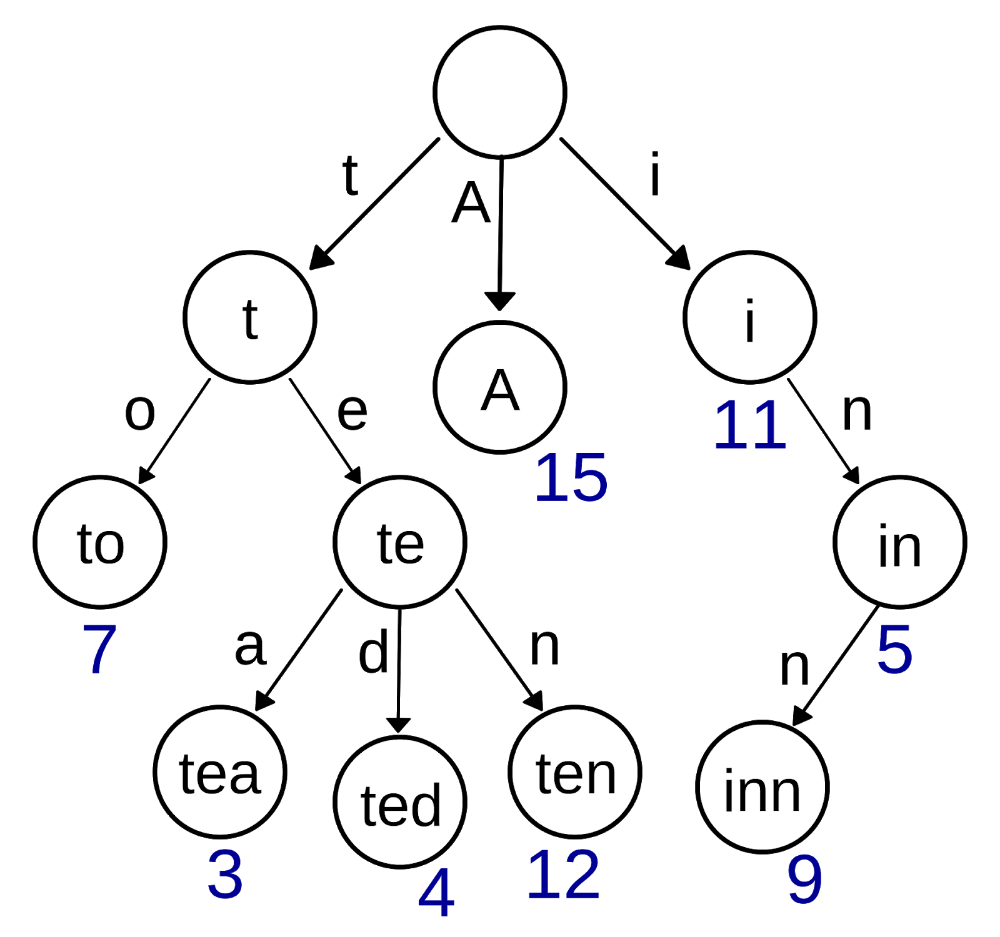

# 字典树（Trie）

## 字典树定义

### 举例

假如有一个字典，字典里面有如下词："A"，"to"，"tea"，"ted"，"ten"，"i"，"in"，"inn"，每个单词还能有自己的一些权重值，那么用前缀树来构建这个字典将会是如下的样子：



#### **性质**

1.  每个节点至少包含两个基本属性：

    -   children：数组或者集合，罗列出每个分支当中包含的所有字符
    -   isEnd：布尔值，表示该节点是否为某字符串的结尾

2.  前缀树的根节点是空的

    所谓空，即只利用到这个节点的 children 属性，即只关心在这个字典里，有哪些打头的字符。

3.  除了根节点，其他所有节点都是有可能是单词的结尾，叶子节点一定都是单词的结尾。

#### **实现**

前缀树最基本的操作就是两个：创建和搜索。

**1. 创建**

-   遍历一遍输入的字符串，对每个字符串进行遍历
-   从前缀树的根节点开始，将每个字符串加入到节点的 children 字符集当中。
-   如果字符集已经包含了这个字符，则跳过。
-   如果当前字符是字符串的最后一个，则把当前节点的 isEnd 标记为真。

由上，创建的方法很直观。

前缀树真正强大的地方在于，每个节点还能用来保存额外的信息，比如可以用来记录拥有相同前缀的所有字符串。因此，当前用户输入某个前缀时，就能在 $O(1)$ 的时间内给出对应的推荐字符串。

trie的节点的定义就很好给出来了（trie的根节点定义成一个空节点）：

```java
class TrieNode {
    /**
     * 存储最后节点的字符串
     */
    String val;
    /**
     * 根据字符排序，[a,b,c,……,z]
     */
    TrieNode[] child = new TrieNode[26];
    /**
     * 是否是最后叶子节点
     */
    boolean isEnd = false;
}
```
插入单词的操作如下：

```java
public void insert(String s) {
  	TrieNode cur = root;
  	for (char c : s.toCharArray()) {
      	//判断是否存在该字符的节点，不存在则创建
      	if (cur.child[c - 'a'] == null) {
        		cur.child[c - 'a'] = new TrieNode();
        		cur = cur.child[c - 'a'];
      	} else
        		cur = cur.child[c - 'a'];
    }
  	//遍历结束后，修改叶子节点的状态，并存储字符串
  	cur.isEnd = true;
  	cur.val = s;
}
```

**2. 搜索**

与创建方法类似，从前缀树的根节点出发，逐个匹配输入的前缀字符，如果遇到了就继续往下一层搜索，如果没遇到，就立即返回。

## 例题分析

### [208. 实现 Trie (前缀树)](https://leetcode-cn.com/problems/implement-trie-prefix-tree/)

#### 题目描述

实现一个 Trie (前缀树)，包含 `insert`, `search`, 和 `startsWith` 这三个操作。

**示例:**

```
Trie trie = new Trie();

trie.insert("apple");
trie.search("apple");   // 返回 true
trie.search("app");     // 返回 false
trie.startsWith("app"); // 返回 true
trie.insert("app");   
trie.search("app");     // 返回 true
```

**说明:**

-   你可以假设所有的输入都是由小写字母 `a-z` 构成的。
-   保证所有输入均为非空字符串。

#### 代码示例

```java
class Trie {
    class TrieNode {
        TrieNode[] children;
        String val;

        TrieNode() {
            children = new TrieNode[26];
        }
    }

    TrieNode root;

    /**
     * Initialize your data structure here.
     */
    public Trie() {
        root = new TrieNode();
    }

    /**
     * Inserts a word into the trie.
     */
    public void insert(String word) {
        TrieNode cur = root;
        for (char c : word.toCharArray()) {
            if (cur.children[c - 'a'] == null) {
                cur.children[c - 'a'] = new TrieNode();
            }
            cur = cur.children[c - 'a'];
        }
        cur.val = word;
    }

    /**
     * Returns if the word is in the trie.
     */
    public boolean search(String word) {
        TrieNode cur = root;
        for (char c : word.toCharArray()) {
            if (cur.children[c - 'a'] == null) {
                break;
            }
            cur = cur.children[c - 'a'];
        }
        if (cur.val != null && cur.val.equals(word)) {
            return true;
        }
        return false;
    }

    /**
     * Returns if there is any word in the trie that starts with the given prefix.
     */
    public boolean startsWith(String prefix) {
        TrieNode cur = root;
        for (char c : prefix.toCharArray()) {
            if (cur.children[c - 'a'] == null) {
                return false;
            }
            cur = cur.children[c - 'a'];
        }
        return true;
    }
}
```

## 练习题

### [212. 单词搜索 II](https://leetcode-cn.com/problems/word-search-ii/)

#### 题目描述

给定一个二维网格 board 和一个字典中的单词列表 words，找出所有同时在二维网格和字典中出现的单词。


单词必须按照字母顺序，通过相邻的单元格内的字母构成，其中“相邻”单元格是那些水平相邻或垂直相邻的单元格。同一个单元格内的字母在一个单词中不允许被重复使用。


>   输入: 
>   words = ["oath","pea","eat","rain"] and board =
>   [
>     ['o','a','a','n'],
>     ['e','t','a','e'],
>     ['i','h','k','r'],
>     ['i','f','l','v']
>   ]
>
>   输出: ["eat","oath"]

**说明:**

你可以假设所有输入都由小写字母  `a-z`  组成。

**提示:**

-   你需要优化回溯算法以通过更大数据量的测试。你能否早点停止回溯？
-   如果当前单词不存在于所有单词的前缀中，则可以立即停止回溯。什么样的数据结构可以有效地执行这样的操作？散列表是否可行？为什么？ 前缀树如何？如果你想学习如何实现一个基本的前缀树，请先查看这个问题：  [实现Trie（前缀树）](https://leetcode-cn.com/problems/implement-trie-prefix-tree/description/)。

#### 解题思路

假如在矩阵里遇到了一个字符 ”V”，而字典里根本就没有以 “V” 开头的字符串，则不需要将深度优先搜索进行下去，可以大大地提高搜索效率。

构建好了前缀树之后，每次从矩阵里的某个字符出发进行搜索的时候，同步地对前缀树进行对比，如果发现字符一直能被找到，就继续进行下去，一步一步地匹配，直到在前缀树里发现一个完整的字符串，把它输出即可。

#### 代码示例

```java
class Solution {
    public List<String> findWords(char[][] board, String[] words) {
        //构建字典树
        Trie myTrie = new Trie();
        TrieNode root = myTrie.root;
        //插入数据
        for (String word : words){
            myTrie.insert(word);
        }

        //构建结果集容器
        List<String> result = new LinkedList<>();
        //矩阵行数
        int m = board.length;
        //矩阵列数
        int n = board[0].length;
        //存储该节点是否访问
        boolean[][] visited = new boolean[n][m];
        //遍历整个二维数组
        for (int i = 0; i < m; i++) {
            for (int j = 0; j < n; j++) {
                find(board, visited, i, j, m, n, result, root);
            }
        }
        return result;
    }

    private void find(char[][] board, boolean[][] visited, int i, int j, int m, int n, List<String> result, TrieNode cur) {
        //边界判断以及是否已经访问判断
        if (i < 0 || i >= m || j < 0 || j >= n || visited[j][i])
            return;
        //获取子节点状态，判断其是否有子节点
        cur = cur.child[board[i][j] - 'a'];
        if (cur == null) {
            return;
        }
        //修改节点状态，防止重复访问
        visited[j][i] = true;
        //找到单词加入
        if (cur.isEnd) {
            result.add(cur.val);
            //找到单词后，修改字典树内叶子节点状态为false，防止出现重复单词
            cur.isEnd = false;
        }
        find(board, visited, i + 1, j, m, n, result, cur);
        find(board, visited, i - 1, j, m, n, result, cur);
        find(board, visited, i, j + 1, m, n, result, cur);
        find(board, visited, i, j - 1, m, n, result, cur);
        //最后修改节点状态为未访问状态
        visited[j][i] = false;
    }


    /**
     * 字典树
     */
    class Trie {
        //创建根节点
        TrieNode root = new TrieNode();

        void insert(String s) {
            TrieNode cur = root;
            for (char c : s.toCharArray()) {
                //判断是否存在该字符的节点，不存在则创建
                if (cur.child[c - 'a'] == null) {
                    cur.child[c - 'a'] = new TrieNode();
                    cur = cur.child[c - 'a'];
                } else
                    cur = cur.child[c - 'a'];
            }
            //遍历结束后，修改叶子节点的状态，并存储字符串
            cur.isEnd = true;
            cur.val = s;
        }
    }

    /**
     * 字典树节点
     */
    class TrieNode {
        /**
         * 存储最后节点的字符串
         */
        String val;
        /**
         * 根据字符排序，[a,b,c,……,z]
         */
        TrieNode[] child = new TrieNode[26];
        /**
         * 是否是最后叶子节点
         */
        boolean isEnd = false;
    }

  public static void main(String[] args) {
        Solution solution = new Solution();
        char[][] chars = {{'o','a','a','n'}, {'e','t','a','e'}, {'i','h','k','r'}, {'i','f','l','v'}};

        String[] words = {"oath","pea","eat","rain"};
        List<String> words1 = solution.findWords(chars, words);

        System.out.println(words1);
    }
}
```


### [820. 单词的压缩编码](https://leetcode-cn.com/problems/short-encoding-of-words/)

#### 题目描述

给定一个单词列表，我们将这个列表编码成一个索引字符串 `S` 与一个索引列表 `A`。

例如，如果这个列表是 `["time", "me", "bell"]`，我们就可以将其表示为 `S = "time#bell#"` 和 `indexes = [0, 2, 5]`。

对于每一个索引，我们可以通过从字符串 `S` 中索引的位置开始读取字符串，直到 "`#`" 结束，来恢复我们之前的单词列表。

那么成功对给定单词列表进行编码的最小字符串长度是多少呢？

**示例：**

```
输入: words = ["time", "me", "bell"]
输出: 10
说明: S = "time#bell#" ， indexes = [0, 2, 5] 。Copy to clipboardErrorCopied
```

**提示：**

1.  `1 <= words.length <= 2000`
2.  `1 <= words[i].length <= 7`
3.  每个单词都是小写字母 。

#### 解题思路

因为我们需要知道单词列表里，哪些单词是其它某个单词的后缀。既然要求的是后缀，我们只要把单词的倒序插入字典树，再用字典树判断某个单词的逆序是否出现在字典树里就可以了。

比如示例中的 `["time", "me", "bell"]`的逆序就是 `["emit", "em", "lleb"]` 。我们可以发现 `em` 是 `emit` 的前缀。所以 `em` 就可以忽略了。我们必须要先插入单词长的数组，否则会有问题。比如如果我先插入了 `em` ，再插入 `emit` ,会发现两个都可以插入进去，很显然是不对的，所以在插入之前需要先根据单词的长度由长到短排序。

#### 代码示例

```java
class Solution {
    public int minimumLengthEncoding(String[] words) {
        int len = 0;
        Trie trie = new Trie();
        // 先对单词列表根据单词长度由长到短排序
        Arrays.sort(words, (s1, s2) -> s2.length() - s1.length());
        // 单词插入trie，返回该单词增加的编码长度
        for (String word: words) {
            len += trie.insert(word);
        }
        return len;
    }
}

// 定义trie
class Trie {
    TrieNode root = new TrieNode();

    public int insert(String word) {
        TrieNode cur = root;
        boolean isNew = false;
        // 倒着插入单词
        for (int i = word.length() - 1; i >= 0; i--) {
            int c = word.charAt(i) - 'a';
            if (cur.children[c] == null) {
                isNew = true; // 是新单词
                cur.children[c] = new TrieNode();
            }
            cur = cur.children[c];
        }
        // 如果是新单词的话编码长度增加新单词的长度+1，否则不变。
        return isNew? word.length() + 1: 0;
    }
}

class TrieNode {
    char val;
  
    TrieNode[] children = new TrieNode[26];
}
```