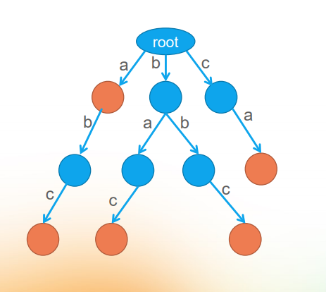

# 字典树（Trie）

## 字典树定义

### 概念

字典树，顾名思义，是关于「字典」的一棵树。即：它是对于字典的一种存储方式（所以是一种数据结构而不是算法）。这个词典中的每个「单词」就是从根节点出发一直到某一个目标节点的路径，路径中每条边的字母连起来就是一个单词。

**图示：**(标橙色的节点是「目标节点」，即根节点到这个「**目标节点**」的路径上的所有字母构成了一个单词。)



那么上图所示的「字典树」包括的单词分别为：

>   a	abc	bac	bbc	ca

 

### **性质**

1.  根节点不包含字符，除根节点外的每一个子节点都包含一个字符；
2.  从根节点到某一节点。路径上经过的字符连接起来，就是该节点对应的字符串；
3.  每个节点的所有子节点包含的字符都不相同。

 

### **实现**

字典树最基本的操作就是两个：**创建和搜索**。

**1. 创建**

假如这个字典树中所存储的字符串都是小写字母，那么每个节点中最多可以包含的字符数量为：26**（如果出现大小写，或者数字等其他字符时，可以根据具体需求，修改 `children` 数组长度）**。那么我们可以直接使用一个长度为 26 的「子节点数组」来存储该节点下子节点所表示的字符。（可以根据具体需求，增加字段值。比如：该「字符」在该字典树中出现过的次数，该「字符串」是否携带一些附加信息，等）

**代码示例**

```java
class TrieNode {
 	  /**
     * 存储最后节点的字符串
     */
    String val;
    /**
     * 根据字符排序，[a,b,c,……,z]
     */
    TrieNode[] children;
    /**
     * 是否是最后叶子节点
     */
    boolean isEnd;
  
    TrieNode() {
        children = new TrieNode[26];
        isEnd = false;
    }
}
```


那么插入操作思路如下：

1.  遍历一遍输入的字符串，对每个字符串进行遍历；
2.  从前缀树的根节点开始，将每个字符串加入到节点的 children 字符集当中；
    -   如果字符集已经包含了这个字符，则跳过；
    -   如果当前字符是字符串的最后一个，则把当前节点的 isEnd 标记为真。

由上，创建的方法很直观。

**代码示例**

```java
public void insert(String s) {
  	TrieNode cur = root;
  	for (char c : s.toCharArray()) {
      	// 判断是否存在该字符的子节点，不存在则创建
      	if (cur.children[c - 'a'] == null) {
        		cur.children[c - 'a'] = new TrieNode();
      	}
        cur = cur.children[c - 'a'];
    }
  	//遍历结束后，修改叶子节点的状态，并存储字符串
  	cur.isEnd = true;
  	cur.val = s;
}
```

 

**2.搜索**

与创建方法类似，从字典树的根节点出发，逐个匹配输入的「前缀字符」，如果该字符存在就继续往下一层搜索，如果没遇到，就立即返回。

**代码示例**

```java
public boolean search(String word) {
    TrieNode cur = root;
    for (char c : word.toCharArray()) {
        // 查看当前节点中 children 数组内是否存在该「字符」
        cur = cur.children[c - 'a'];
        if (cur == null) {
            return false;
        }
    }
    // 判断最终循环结束后当前节点是否为一个单词的结尾
    return cur.isEnd;
}
```


## 例题分析

### [208. 实现 Trie (前缀树)](https://leetcode-cn.com/problems/implement-trie-prefix-tree/)

#### 题目描述

实现一个 Trie (前缀树)，包含 `insert`, `search`, 和 `startsWith` 这三个操作。

**示例:**

```
Trie trie = new Trie();

trie.insert("apple");
trie.search("apple");   // 返回 true
trie.search("app");     // 返回 false
trie.startsWith("app"); // 返回 true
trie.insert("app");   
trie.search("app");     // 返回 true
```

**说明:**

-   你可以假设所有的输入都是由小写字母 `a-z` 构成的。
-   保证所有输入均为非空字符串。

#### 代码示例

```java
class Trie {
    TrieNode root;

    class TrieNode {
        String val;
      
        TrieNode[] children;

        boolean isEnd = false;

        TrieNode() {
            children = new TrieNode[26];
        }
    }

    public Trie() {
        root = new TrieNode();
    }

    public void insert(String word) {
        TrieNode cur = root;
        for (char c : word.toCharArray()) {
            if (cur.children[c - 'a'] == null) {
                cur.children[c - 'a'] = new TrieNode();
            }
            cur = cur.children[c - 'a'];
        }
        cur.isEnd = true;
        cur.val = word;
    }

    public boolean search(String word) {
        TrieNode cur = root;
        for (char c : word.toCharArray()) {
            cur = cur.children[c - 'a'];
            if (cur == null) {
                return false;
            }
        }
        return cur.isEnd;
    }

    public boolean startsWith(String prefix) {
        TrieNode cur = root;
        for (char c : prefix.toCharArray()) {
            if (cur.children[c - 'a'] == null) {
                return false;
            }
            cur = cur.children[c - 'a'];
        }
        return true;
    }
}
```

## 练习题

字典树的应用比较明显，一般都是围绕子串、前缀、后缀，匹配或者计数，列举部分例题。

### [212. 单词搜索 II](https://leetcode-cn.com/problems/word-search-ii/)

#### 题目描述

给定一个二维网格 board 和一个字典中的单词列表 words，找出所有同时在二维网格和字典中出现的单词。


单词必须按照字母顺序，通过相邻的单元格内的字母构成，其中“相邻”单元格是那些水平相邻或垂直相邻的单元格。同一个单元格内的字母在一个单词中不允许被重复使用。


>   输入: 
>   words = ["oath","pea","eat","rain"] and board =
>   [
>     ['o','a','a','n'],
>     ['e','t','a','e'],
>     ['i','h','k','r'],
>     ['i','f','l','v']
>   ]
>
>   输出: ["eat","oath"]

**说明:**

你可以假设所有输入都由小写字母  `a-z`  组成。

**提示:**

-   你需要优化回溯算法以通过更大数据量的测试。你能否早点停止回溯？
-   如果当前单词不存在于所有单词的前缀中，则可以立即停止回溯。什么样的数据结构可以有效地执行这样的操作？散列表是否可行？为什么？ 前缀树如何？如果你想学习如何实现一个基本的前缀树，请先查看这个问题：  [实现Trie（前缀树）](https://leetcode-cn.com/problems/implement-trie-prefix-tree/description/)。

#### 解题思路

假如在矩阵里遇到了一个字符 ”V”，而字典里根本就没有以 “V” 开头的字符串，则不需要将深度优先搜索进行下去，可以大大地提高搜索效率。

构建好了字典树之后，每次从矩阵里的某个字符出发进行搜索的时候，同步地对字典树进行对比，如果发现字符一直能被找到，就继续进行下去，一步一步地匹配，直到在前缀树里发现一个完整的字符串，把它输出即可。

#### 代码示例

```java
class Solution {
    public List<String> findWords(char[][] board, String[] words) {
        // 构建字典树
        Trie trie = new Trie();
        // 根节点
        TrieNode root = trie.root;
        // 插入数据
        for (String word : words) {
            trie.insert(word);
        }

        // 构建结果集容器
        List<String> result = new LinkedList<>();
        // 矩阵行数
        int row = board.length;
        // 矩阵列数
        int col = board[0].length;
        // 存储该节点是否访问
        boolean[][] visited = new boolean[col][row];
        // 遍历整个二维数组
        for (int i = 0; i < row; i++) {
            for (int j = 0; j < col; j++) {
                dfs(board, visited, i, j, row, col, result, root);
            }
        }
        return result;
    }

    private void dfs(char[][] board, boolean[][] visited, int i, int j, int row, int col, List<String> result, TrieNode cur) {
        // 边界判断以及是否已经访问判断
        if (i < 0 || i >= row || j < 0 || j >= col || visited[j][i]) {
            return;
        }
        // 获取子节点状态，判断其是否有子节点
        cur = cur.child[board[i][j] - 'a'];
        if (cur == null) {
            return;
        }
        // 修改节点状态，防止重复访问
        visited[j][i] = true;
        // 找到单词加入
        if (cur.isEnd) {
            result.add(cur.val);
            // 找到单词后，修改字典树内叶子节点状态为false，防止出现重复单词
            cur.isEnd = false;
        }
        // 会出现一个子串是另一个子串的前缀，例如：apple 和 apples
        dfs(board, visited, i + 1, j, row, col, result, cur);
        dfs(board, visited, i - 1, j, row, col, result, cur);
        dfs(board, visited, i, j + 1, row, col, result, cur);
        dfs(board, visited, i, j - 1, row, col, result, cur);
        // 最后修改节点状态为未访问状态
        visited[j][i] = false;
    }


    /**
     * 字典树
     */
    class Trie {
        TrieNode root;

        public Trie() {
            this.root = new TrieNode();
        }

        void insert(String s) {
            TrieNode cur = root;
            for (char c : s.toCharArray()) {
                //判断是否存在该字符的节点，不存在则创建
                if (cur.child[c - 'a'] == null) {
                    cur.child[c - 'a'] = new TrieNode();
                }
                cur = cur.child[c - 'a'];
            }
            //遍历结束后，修改叶子节点的状态，并存储字符串
            cur.isEnd = true;
            cur.val = s;
        }
    }

    /**
     * 字典树节点
     */
    class TrieNode {
        /**
         * 存储最后节点的字符串
         */
        String val;
        /**
         * 根据字符排序，[a,b,c,……,z]
         */
        TrieNode[] child = new TrieNode[26];
        /**
         * 是否是最后叶子节点
         */
        boolean isEnd = false;
    }
}
```

 

### [692. 前K个高频单词](https://leetcode-cn.com/problems/top-k-frequent-words/)

### [676. 实现一个魔法字典](https://leetcode-cn.com/problems/implement-magic-dictionary/)

### [面试题 17.17. 多次搜索](https://leetcode-cn.com/problems/multi-search-lcci/)


