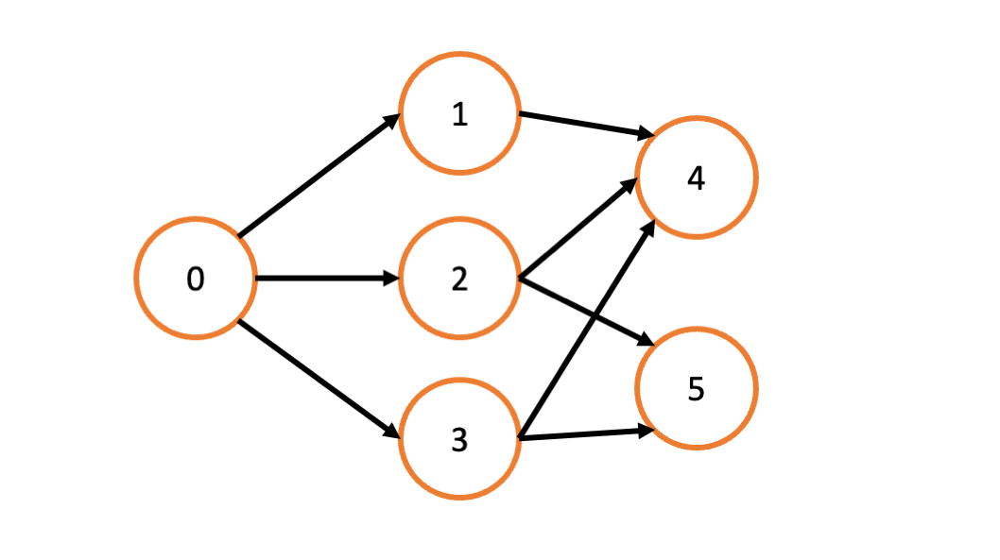
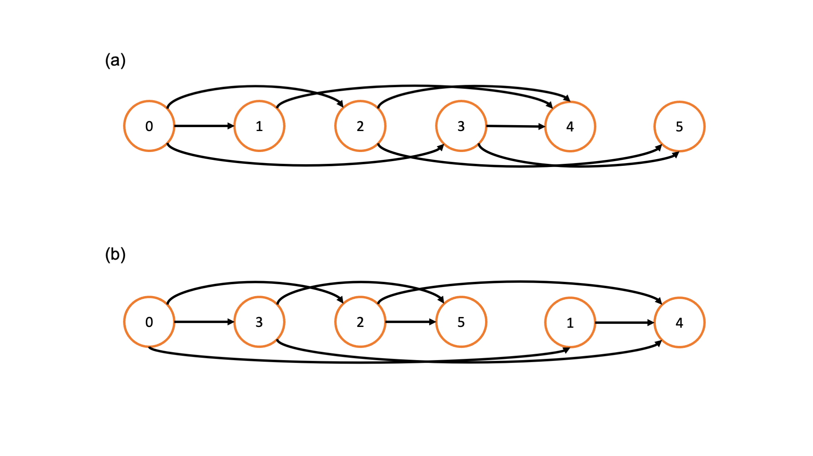
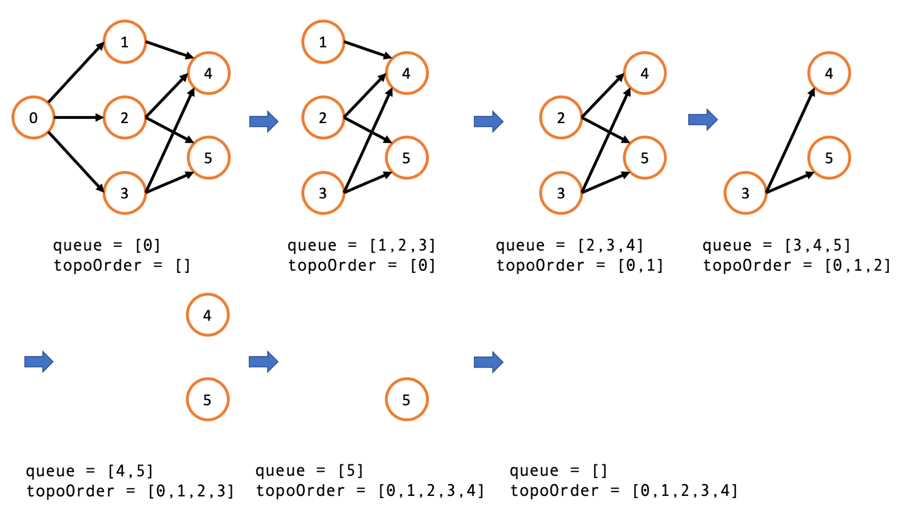
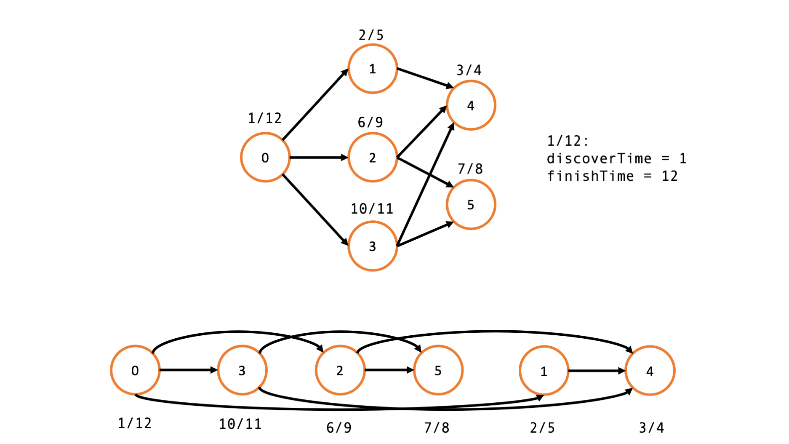
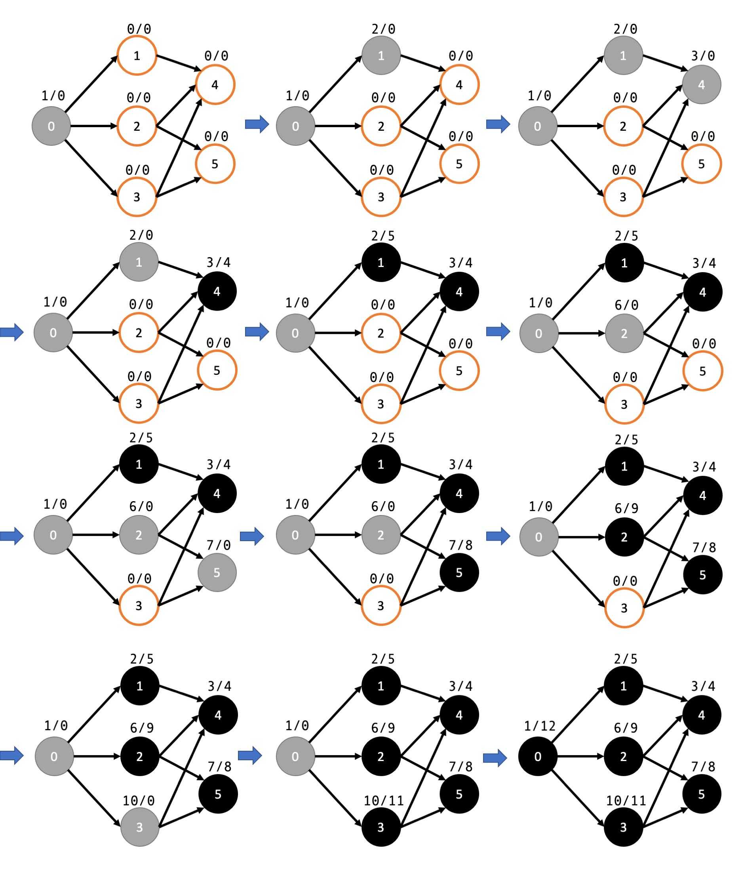
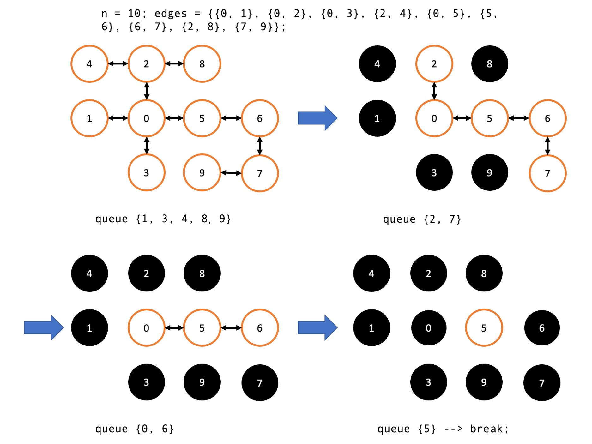

# 拓扑排序算法

作者：wu2meng3

对一个有向无环图（ Directed Acyclic Graph ，简称 DAG ）进行拓扑排序，是指将图中所有结点排成一个线性序列，并满足以下两个条件：

1. 每个结点只出现一次。
2. 若存在一条从结点 A 指向结点 B 的路径，则在序列当中 A 出现在 B 之前。

若一幅图存在环路，则无法进行拓扑排序。另外，对于一幅图，其拓扑排序结果并不唯一。我们采用《算法导论》第 22 章的规范来定义图：$G=(V,E)$，其中 $V$ 是代表结点的集合，$E$ 代表边的集合，$|V|$ 和 $|E|$ 分别代表结点和边的个数。$(u,v) \in E$ 代表存在一个从结点 $u$ 指向结点 $v$ 的有向边。因为我们本章中主要研究稀疏图 ( sparse graph )，所以我们采用邻接表（ adjacency list ）的方式来表示图，其空间开销是 $O(|V|+|E|)$。

例子：下图中，我们定义了一幅有向无环图，



```python
class DirectedGraphNode(object):
  
    def __init__(self, x: int):
        self.label = x
        self.neighbors = []


graph = [DirectedGraphNode(i) for i in range(0, 6)]
graph[0].neighbors = [graph[1], graph[2], graph[3]]
graph[1].neighbors = [graph[4]]
graph[2].neighbors = [graph[4], graph[5]]
graph[3].neighbors = [graph[4], graph[5]]
```

如图所示，其拓扑排序的结果可以是: (a) `0->1->2->3->4->5` 或者 (b) `0->3->2->5->1->4`。



## 拓扑排序的应用

举个穿衣服的例子，穿鞋子之前要穿袜子，以及先穿衬衫再穿外套。穿袜子和穿鞋子这两个任务之间就存在完成次序的依赖，而穿鞋子和穿衬衫并没有这种依赖。通过拓扑排序算法，我们就可以制定一个按次序完成任务的计划，比如说按照袜子，鞋子，衬衫，外套这样的次序来着装。

另外，采用 `Makefile` 进行编译的过程中也要用到拓扑排序对于文件和库的依赖关系进行梳理。

## 拓扑排序的两个模板

使用以下两个模板，我们可以判断一幅图是否可以进行拓扑排序，如果无法进行拓扑排序，则输出空列表；如果可以进行拓扑排序，则输出一种可能的拓扑排序之后的序列。

### 宽度优先搜索 （ Breadth-first search， BFS ）：

#### 思路

该算法也叫 [Kahn 算法](https://en.wikipedia.org/wiki/Topological_sorting#Kahn's_algorithm)。首先，我们需要介绍**入度**（ indegree ）的概念。在有向图当中，一个结点的入度表示有多少条边指向它。对应的还有一个概念叫**出度** （ outdegree ），代表从一个结点出发有多少条边，但是在拓扑排序当中我们只会用到入度。入度为 0 的点的集合将作为 BFS 的起点。如果没有入度为 0 的点，则无法进行拓扑排序。BFS 由先进先出 （First In, First Out, FIFO）的队列 （ queue ）数据结构来实现。BFS 算法实现拓扑排序的伪代码如下：

BFS 算法理解起来非常直观，我们先拿出不被任何结点指向的节点（入度为 0 ）的结点，然后把它从图中删去（同时更新余下所有结点的入度）并加入到输出序列。我们用一个队列 `queue` 来维护当前图中所有结点，用 `topoOrder` 保存输出序列。具体执行过程以及对应的 `queue` 和 `topoOrder` 的值都展示在下图中。



```python
topoOrder ← 输出列表，初始为空
queue ← 包含所有入度为 0 的结点的队列
while ( queue 不为空 ) do
    n 出列 queue
    将 n 放入 topoOrder
    for ( n 的所有邻接结点 m ) do
        删除该边，m 的入度减 1
        if ( m 入度为 0 ) then
            m 入列 queue

if （ 图中存在边 ） then
    # 存在环，不可以拓扑排序
    return None
else
    return topoOrder
```

之前说过拓扑排序结果并不唯一，按照字典序 （ lexicographical order ）可以将所有可能的输出结果进行排序。如果需要最大或者最小结果，可以将上述算法中的队列替换成最大堆/最小堆实现的优先队列即可，具体实现请参考精选例题。

#### 代码

```python
from typing import *
import collections

class Solution(object):

	def topSort(self, graph: Dict[int, List[int]]) -> List[int]:
		    # 计算入度
        inDegree = self.getInDegree(graph)
				
        # 将入度为 0 的结点放入队列 queue 和哈希集合 visited 防止重复遍历
        startNodeList = [ node for node in graph if inDegree[node] == 0]
        queue = collections.deque(startNodeList)
        visited = set(startNodeList)
        
        # 保存结果的数组
        topoOrder = []
        
        # count 用于判断是否存在环
        count = len(graph)

        # BFS
        while queue:
            node = queue.popleft()
            topoOrder.append(node)

            for neighbor in node.neighbors:
                if neighbor in visited:
                    continue
                inDegree[neighbor] -= 1
                if inDegree[neighbor] == 0:
                    queue.append(neighbor)
                    visited.add(neighbor)

        # 存在环，返回空列表
        if count != 0:
            return []
        return topoOrder
```
**复杂度分析**

* 时间复杂度：计算入度的循环需要遍历每个结点和每条边，BFS 循环也要遍历每一条边并且将每个结点入列和出列一次，入列和出列操作都是 $O(1)$, 所以总的时间复杂度是 $O(|V|+|E|)$ 。

* 空间复杂度：我们需要一个数组或者字典来存储每个结点的入度，还需要一个队列来存储入度为 0 的结点，总的空间复杂度为 $O(|V|)$ 。

### 深度优先搜索（ Depth-first search， DFS）

对于拓扑排序而言，读者需要熟练掌握 BFS 解法，因为其更常见，且思路相对自然。 DFS 解法可以作为补充，了解即可。

#### 思路

一句话总结就是**拓扑排序就是图后序遍历的倒序输出**。我们现在将这句话展开来理解。根据《算法导论》第 22 章，我们可以在 DFS 的过程中给每个结点盖两个时间戳，分别是发现这个结点的时间 `discoverTime[u]` 和遍历完该结点所有邻接结点的时间 `finishTime[u]` ，其中 `u` 代表一个结点。对于结点 `u`，DFS 算法遍历完其所有子结点之后才会判断其遍历结束，更新时间戳 `finishTime[u]` 。可以证明如果图中存在一条从 `u` 指向 `v` 的边，那么 `finishTime[v] < finishTime[u]` 。所以，按照 `finishTime` 的逆序输出结点就可以得到拓扑排序之后的序列。该算法有点类似回溯算法，我们需要在递归之前和递归之后更新每个结点的状态。每个结点有三种的可能的状态，分别是：
* `UNVISITED`：未被发现；
* `VISITING`：已发现，但是邻接结点还未遍历完；
* `VISITED`：已发现，邻接结点已经遍历完。

所有结点的初始状态都是`UNVISITED`，在遍历某结点的所以邻接结点进入下一层递归之前要将该结点的状态设为 `VISITING`，所有邻接结点都遍历完递归返回之后将其状态更新为 `VISITED`。

沿用上面的例子，DFS 算法得到的拓扑排序序列和每个结点的发现／完成时间如下图所示。



DFS 算法的伪代码如下：

```python
topoOrder ← 输出列表，初始为空
while 存在状态为 UNVISITED 的结点 do
    取状态为 UNVISITED 的结点 n
    visit(n)

function visit(node n)
    if n 的状态为 VISITING then
  			# 存在环，无法进行拓扑排序
        stop

    if n 的状态为 VISITED then
        # 不要重复遍历
        return

    将 n 的状态标记为 VISITING

    for n 的所有邻接结点 m do
        visit(m)

    将 n 的状态标记为 VISITED
    将 n 加入 topoOrder 的首位
```

#### 代码

```python
from typing import *
from enum import Enum
import collections

# 遍历过程中结点的三种状态
class State(Enum):
    # 《算法导论》中的 WHITE 状态：未被发现
    UNVISITED = 0
    # 《算法导论》中的 GREY 状态：已发现，但是邻接结点还未遍历完
    VISITING = 1
    # 《算法导论》中的 BLACK 状态：已发现，邻接结点已经遍历完
    VISITED = 2


class Solution(object):

    def __init__(self):
        # 全局时间
        self.time = 0
        # 发现时间
        self.discoverTime = collections.defaultdict(lambda: 0)
        # 完成时间
        self.finishTime = collections.defaultdict(lambda: 0)

    def topSort(self, graph: List[DirectedGraphNode]) -> List[int]:
        states = {node: State.UNVISITED for node in graph}
        res = []

        for node in graph:
            # 如果存在环，返回空列表
            if (self.hasCycle(graph, node, states, res)):
                return []
        
        # 倒序输出后序遍历结果
        return res[::-1]
		
    # 判断是否存在环，存在则返回 True
    def hasCycle(self, graph, node, states, res):
        # 如果该结点被发现两次，说明有环
        if states[node] == State.VISITING:
            return True

        # 如果该结点已经遍历结束，则该递归分支结束
        if states[node] == State.VISITED:
            return False
        
        # VISITING 代表该结点已经被发现，但是其邻接结点还未遍历完
        states[node] = State.VISITING
        
        # 更新发现时间
        self.time += 1
        self.discoverTime[node] = self.time

        # 递归处理子结点，将子结点加入 res 列表
        for child in node.neighbors:
            if (self.hasCycle(graph, child, states, res)):
                return True
        
        # 后序遍历
        res.append(node)
        # 邻接结点已经遍历结束
        states[node] = State.VISITED

        # 更新完成时间
        self.time += 1
        self.finishTime[node] = self.time

        return False
```

**复杂度分析**

* 时间复杂度：在 DFS 过程中，每一个结点和每一条边都会被访问一次，将一个结点按照完成时间 `finishTime[u]` 的顺序放入输出数组需要 $O(1)$ 的时间，所以总的时间复杂度是 $O(|V|+|E|)$。

* 空间复杂度：我们需要 `states` 数组或者字典来保存每个结点的状态，所以空间复杂度是 $O(|V|)$ 。

为了形象的理解 DFS 的过程，我们将上述代码的执行过程以及每个结点的发现时间 `discoverTime` 和 完成时间 `finishTime` 的值都表示在下面的图中。我们用白色代表 `UNVISITED` ，灰色代表 `VISITING`，黑色代表 `VISITED`。



## 精选例题

### 题型一：课程表

例题 1: 「力扣」 第 207 题：[课程表（Course Schedule）](https://leetcode-cn.com/problems/course-schedule/)

例题 2: 「力扣」 第 210 题：[课程表 II（Course Schedule II）](https://leetcode-cn.com/problems/course-schedule-ii/)

> 现在你总共有 `numCourses` 门课需要选，记为 `0`到 `numCourses - 1`。
> 给你一个数组 `prerequisites` ，其中 `prerequisites[i] = [a, b]` ，表示在选修课程 `a` 前**必须**先选修 `b` 。
>
> * 返回你为了学完所有课程所安排的学习顺序。
> * 可能会有多个正确的顺序，你只要返回**任意一种**就可以了。
> * 如果不可能完成所有课程，返回**一个空数组**。

**分析**

* 这两道题例题就是最经典的拓扑排序应用，我们直接套用上述模板即可。

BFS 代码：

<!-- tabs:start -->

#### **Python3**

```python
from typing import *
import collections


class Solution(object):

    def findOrder(self, numCourses: int, prerequisites: List[List[int]]) -> List[int]:
      	# 通过 prerequisites 构造图
        graph = self.buildGraph(numCourses, prerequisites)
        # 计算入度
        inDegree = {i: 0 for i in range(numCourses)}
        for prerequisite in prerequisites:
            inDegree[prerequisite[0]] += 1

        startNodeList = [i for i in range(numCourses) if inDegree[i] == 0]
        queue = collections.deque(startNodeList)
        visited = set(startNodeList)
        topoOrder = []
        count = numCourses
        # BFS
        while queue:
            node = queue.popleft()
            topoOrder.append(node)
            count -= 1

            for child in graph[node]:
                if child in visited:
                    continue

                inDegree[child] -= 1

                if inDegree[child] == 0:
                    queue.append(child)
                    visited.add(child)
        
        # 判断是否存在环
        if count != 0:
            return []

        return topoOrder

    def buildGraph(self, N: int, relations: List[List[int]]):
        graph = {i: [] for i in range(N)}

        for relation in relations:
            graph[relation[1]].append(relation[0])

        return graph
```

#### **C++**

```c++
class Solution {
 public:
  vector<int> findOrder(int numCourses, vector<vector<int>>& prerequisites) {
    vector<vector<int>> graph(numCourses);
    vector<int> inDegree(numCourses, 0);

    for (const auto& prerequisite : prerequisites) {
      const int in = prerequisite[0];
      const int out = prerequisite[1];

      graph[out].push_back(in);
      inDegree[in]++;
    }

    vector<int> topoOrder;
    set<int> visited;
    queue<int> queue;

    for (int i = 0; i < numCourses; i++) {
      if (inDegree[i] == 0) {
        queue.push(i);
        visited.insert(i);
      }
    }

    while (!queue.empty()) {
      const int node = queue.front();
      queue.pop();
      topoOrder.push_back(node);

      for (const int child : graph[node]) {
        if (visited.find(child) != visited.end()) {
          continue;
        }

        inDegree[child]--;
        if (inDegree[child] == 0) {
          queue.push(child);
          visited.insert(child);
        }
      }
    }

    if (topoOrder.size() == numCourses) {
      return topoOrder;
    }
    return vector<int>();
  }
};
```

#### **Java**

```java
class Solution {
  public static int[] findOrder(int numCourses, int[][] prerequisites) {
    Map<Integer, ArrayList<Integer>> graph = new HashMap<Integer, ArrayList<Integer>>();
    int[] inDegree = new int[numCourses];

    for (int i = 0; i < numCourses; i++)
      graph.put(i, new ArrayList<Integer>());

    for (final int[] prerequisite : prerequisites) {
      final int out = prerequisite[1];
      final int in = prerequisite[0];
      graph.get(out).add(in);
      inDegree[in]++;
    }

    List<Integer> topoOrder = new ArrayList<>();
    HashSet<Integer> visited = new HashSet<Integer>();
    Queue<Integer> queue = new LinkedList<Integer>();

    for (int i = 0; i < numCourses; i++) {
      if (inDegree[i] == 0) {
        queue.offer(i);
        visited.add(i);
      }
    }

    while (!queue.isEmpty()) {
      final int node = queue.poll();
      topoOrder.add(node);

      for (final int child : graph.get(node)) {
        if (visited.contains(child))
          continue;
        inDegree[child]--;
        if (inDegree[child] == 0) {
          queue.offer(child);
          visited.add(child);
        }
      }
    }

    if (topoOrder.size() == numCourses) {
      return topoOrder.stream().mapToInt(i -> i).toArray();
    }

    return new int[] {};
  }
}
```

<!-- tabs:end -->

DFS 代码：

<!-- tabs:start -->

#### **Python**

```python
from enum import Enum

# 结点的三种状态
class State(Enum):
    UNVISITED = 0
    VISITING = 1
    VISITED = 2


class Solution(object):

    def findOrder(self, numCourses: int, prerequisites: List[List[int]]) -> List[int]:
        # 通过 prerequisites 构造图
        graph = self.buildGraph(numCourses, prerequisites)
        # 初始化结点状态
        states = {node: State.UNVISITED for node in graph}
        res = []
				
        # DFS
        for node in graph:
            if (self.hasCycle(graph, node, states, res)):
                return []
        
        # 逆序输出后序遍历结果
        return res[::-1]

    def buildGraph(self, N: int, relations: List[List[int]]) -> Dict[int, List[int]]:
        graph = {i: [] for i in range(N)}

        for relation in relations:
            graph[relation[1]].append(relation[0])

        return graph

    def hasCycle(self, graph: Dict[int, List[int]], node: int, states: List[State], res: List[int]) -> bool:
        if states[node] == State.VISITING:
            return True

        if states[node] == State.VISITED:
            return False

        states[node] = State.VISITING

        for child in graph[node]:
            if (self.hasCycle(graph, child, states, res)):
                return True

        res.append(node)
        states[node] = State.VISITED

        return False
```

#### **C++**

```c++
enum State { UNVISITED, VISITING, VISITED };

class Solution {
 public:
  vector<int> findOrder(int numCourses, vector<vector<int>>& prerequisites) {
    vector<vector<int>> graph(numCourses);

    // Build graph and inDegree
    for (const auto& prerequisite : prerequisites) {
      const int in = prerequisite[0];
      const int out = prerequisite[1];

      graph[out].push_back(in);
    }

    vector<State> states(numCourses);
    vector<int> res;

    // DFS
    for (int node = 0; node < graph.size(); node++) {
      if (hasCycle(graph, node, states, res)) {
        return {};
      }
    }

    reverse(res.begin(), res.end());
    return res;
  }

 private:
  bool hasCycle(const vector<vector<int>>& graph, const int node,
                vector<State>& states, vector<int>& res) {
    if (states[node] == VISITING) return true;
    if (states[node] == VISITED) return false;

    states[node] = VISITING;

    for (const auto& child : graph[node]) {
      if (hasCycle(graph, child, states, res)) return true;
    }

    res.push_back(node);
    states[node] = VISITED;
    return false;
  }
};
```

#### **Java**

```java
class Solution {
  public enum States {
    UNVISITED, VISITING, VISITED
  }

  public static int[] findOrder(int numCourses, int[][] prerequisites) {
    Map<Integer, ArrayList<Integer>> graph = new HashMap<Integer, ArrayList<Integer>>();
    States[] states = new States[numCourses];
    ArrayList<Integer> res = new ArrayList<Integer>();

    Arrays.fill(states, States.UNVISITED);

    for (int i = 0; i < numCourses; i++)
      graph.put(i, new ArrayList<Integer>());

    for (final int[] prerequisite : prerequisites) {
      final int in = prerequisite[0];
      final int out = prerequisite[1];
      graph.get(out).add(in);
    }

    for (int i = 0; i < numCourses; i++) {
      if (hasCycle(graph, i, states, res)) {
        return new int[] {};
      }
    }

    Collections.reverse(res);
    
    return res.stream().mapToInt(i -> i).toArray();
  }

  private static boolean hasCycle(Map<Integer, ArrayList<Integer>> graph, int node, States[] states,
      ArrayList<Integer> res) {
    if (states[node] == States.VISITING)
      return true;
    if (states[node] == States.VISITED)
      return false;

    states[node] = States.VISITING;

    for (final int child : graph.get(node)) {
      if (hasCycle(graph, child, states, res)) {
        return true;
      }
    }

    res.add(node);
    states[node] = States.VISITED;

    return false;
  }
}
```

<!-- tabs:end -->

**复杂度分析**：

* 时间复杂度：$O(|V|+|E|)$，其中 $V$ 是所有课程的集合，$E$ 是所有先修课程要求的集合。
* 空间复杂度：$O(|V|+|E|)$。

### 题型二：最大/最小字典序拓扑排序

例题 3: LintCode 第892题，[外星人字典（ Alien Dictionary）](https://www.lintcode.com/problem/892/)

> 有一种新的使用拉丁字母的外来语言。但是，你不知道字母之间的顺序。你会从词典中收到一个非空的单词列表，其中的单词在这种新语言的规则下按字典顺序排序。请推导出这种语言的字母顺序。
> * 假设所有字母都是小写。
> * 如果单词 `a` 是单词 `b` 的前缀且 `b` 出现在 `a` 之前，那么这个顺序是无效的。
> * 如果顺序是无效的，则返回空字符串。
> * 这里可能有多个有效的字母顺序，返回以正常字典顺序看来最小的。

**分析**：
* 字典序可以看成一幅图，结点是所有出现过的拉丁字母，有向边 `(a, b)` 代表在字典序当中字母 `a` 排在字母 `b` 前面。
* 通过比较相邻的单词，可以得到关于该字典序的线索，将其作为边加入图。
* 为了返回用正常英文字典顺序看来最小的结果，用 BFS 遍历的时候，需要保证每次出列的字符都是队列中最小的。

以下是 BFS + 最小堆实现的代码。

<!-- tabs:start -->

#### **Python**

```python
from typing import *
import heapq 

class Solution(object):

    def alienOrder(self, words: List[str]) -> str:
        graph, inDegree = self.buildGraph(words)

        if not graph:
            return ""
				
        # BFS
        minheap = [char for char in graph if inDegree[char] == 0]
        heapq.heapify(minheap)
        visited = set(minheap)
        topoOrder = ""
        count = len(inDegree)

        while minheap:
            node = heapq.heappop(minheap)
            topoOrder += node
            count -= 1

            for child in graph[node]:
                if child in visited:
                    continue
                inDegree[child] -= 1
                if inDegree[child] == 0:
                    heapq.heappush(minheap, child)
                    visited.add(child)

        if count != 0:
            return ""

        return topoOrder

    def buildGraph(self, words: List[str]) -> Tuple[Dict[str, Set[str]], Dict[str, int]]:
        graph = {char: set() for word in words for char in word}
        inDegree = {char: 0 for char in graph}

        # Build graph
        for i in range(1, len(words)):
            w1 = words[i-1]
            w2 = words[i]
            for j in range(min(len(w1), len(w2))):
                if w1[j] != w2[j]:
                    graph[w1[j]].add(w2[j])
                    break

                # Check invalid input order: e.g., w1="abc", w2="ab"
                if j == min(len(w1), len(w2)) - 1 and len(w1) > len(w2):
                    graph.clear()
                    inDegree.clear()
                    return {}, {}

        # Build inDegree
        for char in graph:
            for child in graph[char]:
                inDegree[child] += 1

        return graph, inDegree
```

#### **C++**

```c++
class Solution {
 public:
  string alienOrder(vector<string>& words) {
    unordered_map<char, unordered_set<char>> graph;
    unordered_map<char, int> inDegree;
    buildGraph(words, graph, inDegree);
    
    if (graph.empty()) return "";

    // BFS
    priority_queue<char, vector<char>, greater<char>> minHeap;
    unordered_set<char> visited;
    string topoOrder;

    for (const auto& [c, count] : inDegree) {
      if (count == 0) {
        minHeap.push(c);
        visited.insert(c);
      }
    }

    int count = inDegree.size();

    while (!minHeap.empty()) {
      const auto node = minHeap.top();

      minHeap.pop();
      topoOrder += node;
      count--;

      for (const auto child : graph[node]) {
        if (visited.find(child) != visited.end()) continue;
        inDegree[child]--;
        if (inDegree[child] == 0) {
          minHeap.push(child);
          visited.insert(child);
        }
      }
    }

    if (count != 0) return "";

    return topoOrder;
  }

 private:
  // Initialize graph and inDegree
  void buildGraph(vector<string>& words,
                  unordered_map<char, unordered_set<char>>& graph,
                  unordered_map<char, int>& inDegree) {
    
    // Initialize graph and inDegree
    for (const auto& word : words) {
      for (const auto& c : word) {
        graph[c] = unordered_set<char>();
        inDegree[c] = 0;
      }
    }
    
    // Build graph
    for (int i = 1; i < words.size(); i++) {
      const auto w1 = words[i - 1];
      const auto w2 = words[i];
      const int minLen = min(w1.length(), w2.length());
      for (int j = 0; j < minLen; j++) {
        if (w1[j] != w2[j]) {
          graph[w1[j]].insert(w2[j]);
          break;
        }

        // Check invalid input order: e.g., w1="abc", w2="ab"
        if (j == minLen - 1 && w1.length() > w2.length()) {
          graph.clear();
          inDegree.clear();
          return;
        }
      }
    }

    // Build inDegree
    for (const auto& [c, children] : graph) {
      for (const auto& child : children) {
        inDegree[child]++;
      }
    }

    return;
  }
};
```

#### **Java**

```java
public class Solution {
  public static String alienOrder(String[] words) {
    Map<Character, Set<Character>> graph = new HashMap<>();
    Map<Character, Integer> inDegree = new HashMap<>();
    buildGraph(words, graph, inDegree);

    if (graph.isEmpty())
      return "";
		
    // BFS
    StringBuilder topoOrder = new StringBuilder();
    PriorityQueue<Character> minHeap = new PriorityQueue<>();
    Set<Character> visited = new HashSet<>();

    for (final char c : inDegree.keySet()) {
      if (inDegree.get(c) == 0) {
        minHeap.offer(c);
        visited.add(c);
      }
    }

    int count = inDegree.size();

    while (!minHeap.isEmpty()) {
      final char node = minHeap.poll();
      topoOrder.append(node);
      count--;
      for (final char child : graph.get(node)) {
        if (visited.contains(child))
          continue;

        inDegree.put(child, inDegree.get(child) - 1);

        if (inDegree.get(child) == 0) {
          minHeap.offer(child);
          visited.add(child);
        }
      }
    }

    if (count != 0)
      return "";

    return topoOrder.toString();
  }

  private static void buildGraph(String[] words, Map<Character, Set<Character>> graph,
      Map<Character, Integer> inDegree) {
    // Initialize graph and InDegree
    for (final String word : words) {
      for (final char c : word.toCharArray()) {
        graph.putIfAbsent(c, new HashSet<Character>());
        inDegree.putIfAbsent(c, 0);
      }
    }

    // Build graph
    for (int i = 1; i < words.length; i++) {
      final String w1 = words[i - 1];
      final String w2 = words[i];
      final int minLen = Math.min(w1.length(), w2.length());
      for (int j = 0; j < minLen; j++) {
        final char u = w1.charAt(j);
        final char v = w2.charAt(j);
        if (u != v) {
          graph.get(u).add(v);
          break;
        }
        
        // Check invalid input order: e.g., w1="abc", w2="ab"
        if (j == minLen - 1 && w1.length() > w2.length()) {
          graph.clear();
          inDegree.clear();
          return;
        }
      }
    }

    // Build inDegree
    for (final Map.Entry<Character, Set<Character>> entry : graph.entrySet()) {
      final char c = entry.getKey();
      final Set<Character> children = entry.getValue();
      for (final char child : children) {
        inDegree.put(child, inDegree.get(child) + 1);
      }
    }
  }
}
```

<!-- tabs:end -->

**复杂度分析**：

* 时间复杂度：$O(|V|+|E|)$，其中 $V$ 是所有字符的集合，$E$ 是所有字典序线索的集合。
* 空间复杂度：$O(|V|+|E|)$。

### 题型三：最小高度树

例题 4: 「力扣」 第 310 题：[最小高度树](https://leetcode.com/problems/minimum-height-trees/)

> 给你一棵包含 `n` 个节点的树，标记为 `0` 到 `n-1` 。给定数字 `n` 和一个有 `n-1` 条无向边的 `edges` 列表，其中 `edges[i] = [ai, bi]` 表示树中节点 `ai` 和 `bi` 之间存在一条无向边。
> 可选择树中任何一个节点作为根。当选择节点 `x` 作为根节点时，设结果树的高度为 `h` 。在所有可能的树中，具有最小高度的树（即 `min(h)` ）被称为最小高度树 。
> 请你找到所有的 最小高度树 并按**任意顺序**返回它们的根节点标签列表。
> 树的**高度**是指根节点和叶子节点之间最长向下路径上边的数量。
>
> * `1<= n <= 2 * 10^4`。
> * 给定的输入保证是一棵树，不会有重复的边。

**分析**：
* 这道题也可以从每个节点出发用BFS得到以当前节点为根的树的高度，然后取对应高度最小的那些根节点。但是这样效率显然很低，有大量的重复计算。采用拓扑排序的方法，只需要一次遍历就可以得到最小高度树对应的根节点列表。
* 首先，一个重要的结论是：这样的根节点最多只有 2 个。假设有 3 个及以上这样的根节点，根据提议，这些根节点也必须是相连的，那么就可以以靠中间的节点为根的树就会比以靠边节点为根的树高，从而可以反证得到最小高度树的根节点数量只能小于等于 2 。
* 通过层级遍历的方法，我们可以从所有叶子节点出发，每次往上走一步，直到最后只省一个或者两个节点，那么这些节点就是我们要找的最小高度树的根节点。
* 注意，这里给的 `edges` 对应的是无向图，所以 `[1, 2]` 实际代表了两条有向边，在构造邻接表的过程中要增加 `1->2` 和 `2->1` 两条边。与前几道题不同的是，这里的叶子节点判断条件是入度为 1 。
* 针对一个例子（ `n=10`, `edges = {{0, 1}, {0, 2}, {0, 3}, {2, 4}, {0, 5}, {5, 6}, {6, 7}, {2, 8}, {7, 9}}` ），下图展示了从叶子节点每一步 BFS 层级遍历时队列 queue 里面存放的节点。白色的节点代表还没被遍历，黑色的节点已经被遍历。



以下是 BFS 实现的拓扑排序代码。

<!-- tabs:start -->

#### **Python**

```python
class Solution:
    def findMinHeightTrees(self, n: int, edges: List[List[int]]) -> List[int]:
        if n <= 1:
            return [i for i in range(n)]

        res = []
        # Build directed graph
        graph = {i: [] for i in range(n)}
        inDegree = {i: 0 for i in range(n)}
        for edge in edges:
            graph[edge[0]].append(edge[1])
            inDegree[edge[1]] += 1
            graph[edge[1]].append(edge[0])
            inDegree[edge[0]] += 1
        
        # BFS
        startNodes = [i for i in range(n) if inDegree[i] == 1]
        queue = collections.deque(startNodes)
        visited = set(startNodes)

        count = n
        while queue:
            if count <= 2:
                break
            # Level-order traversal
            size = len(queue)
            for _ in range(size):
                node = queue.popleft()
                count -= 1

                for child in graph[node]:
                    if child in visited:
                        continue

                    inDegree[child] -= 1
                    if inDegree[child] == 1:
                        queue.append(child)
                        visited.add(child)

        # Convert queue to list
        return list(queue)
```

#### **C++**

```c++
class Solution {
 public:
  /**
   * @param n: n nodes labeled from 0 to n - 1
   * @param edges: a undirected graph
   * @return:  a list of all the MHTs root labels
   */
  vector<int> findMinHeightTrees(int n, vector<vector<int>> &edges) {
    if (n == 1) return vector<int>(1, 0);
    vector<int> res;

    // Build graph and inDegree
    vector<vector<int>> graph(n);
    vector<int> inDegree(n);

    for (const auto &edge : edges) {
      const auto from = edge[0];
      const auto to = edge[1];
      graph[from].push_back(to);
      inDegree[to]++;
      graph[to].push_back(from);
      inDegree[from]++;
    }
      
    // BFS
    queue<int> q;
    unordered_set<int> visited;
    for (int i = 0; i < n; i++) {
      if (inDegree[i] == 1) {
        q.push(i);
        visited.insert(i);
      }
    }

    int count = n;
    while (!q.empty()) {
      if (count <= 2) {
        break;
      }
      // Level-order traversal
      int size = q.size();
      for (int i = 0; i < size; i++) {
        int node = q.front();
        q.pop();
        count--;

        for (const auto &child : graph[node]) {
          if (visited.find(child) != visited.end()) continue;
          inDegree[child]--;
          if (inDegree[child] == 1) {
            q.push(child);
            visited.insert(child);
          }
        }
      }
    }

    // Convert queue<int> to vector<int>
    while (!q.empty()) {
      res.emplace_back(move(q.front()));
      q.pop();
    }

    return res;
  }
};
```

#### **Java**

```java
class Solution {
  public List<Integer> findMinHeightTrees(int n, int[][] edges) {
    List<Integer> res = new ArrayList<>();
    if (n == 1) {
      res.add(0);
      return res;
    }
    
    // Build graph and inDegree
    Map<Integer, ArrayList<Integer>> graph = new HashMap<>();
    int[] inDegree = new int[n];

    for (int i = 0; i < n; i++) {
      graph.put(i, new ArrayList<Integer>());
    }

    for (final int[] edge : edges) {
      final int n0 = edge[0];
      final int n1 = edge[1];
      graph.get(n0).add(n1);
      inDegree[n1]++;
      graph.get(n1).add(n0);
      inDegree[n0]++;
    }

    // BFS
    Queue<Integer> q = new LinkedList<Integer>();
    Set<Integer> visited = new HashSet<Integer>();
    int count = n;

    for (int i = 0; i < n; i++) {
      if (inDegree[i] == 1) {
        q.offer(i);
        visited.add(i);
      }
    }

    while (!q.isEmpty()) {
      if (count <= 2) {
        break;
      }
      // Level-order traversal
      final int size = q.size();
      for (int i = 0; i < size; i++) {
        final int node = q.poll();
        count--;

        for (final int child : graph.get(node)) {
          if (visited.contains(child))
            continue;
          inDegree[child]--;
          if (inDegree[child] == 1) {
            q.offer(child);
            visited.add(child);
          }
        }
      }
    }

    // Convert Queue into List<Integer>
    while (!q.isEmpty()) {
      int node = q.poll();
      res.add(node);
    }

    return res;
  }
}
```

<!-- tabs:end -->

**复杂度分析**：

* 时间复杂度：$O(n)$，`n` 为节点个数。
* 空间复杂度：$O(n)$。

## 精选练习

| 题目                                                         | 类型                         |
| ------------------------------------------------------------ | ---------------------------- |
| [LeetCode 1136. 平行课程](https://leetcode-cn.com/problems/parallel-courses/) | 中等，必做                   |
| [LeetCode 1462. 课程表 IV](https://leetcode.com/problems/course-schedule-iv/) | 中等， 必做 |
| [LeetCode 329. 矩阵中的最长递增路径](https://leetcode-cn.com/problems/longest-increasing-path-in-a-matrix/) | 困难，必做 |
| [LintCode 605. 序列重构](https://www.lintcode.com/problem/605/) | 中等， 必做|

## 参考

* [Topological sorting @ Wikipedia](https://en.wikipedia.org/wiki/Topological_sorting#Kahn's_algorithm)
* https://oi-wiki.org/graph/topo/
* 《算法导论》第 22 章
