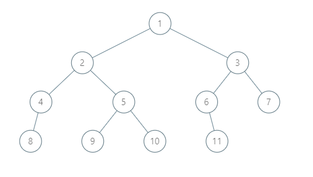



# 树的总结以及 Java 代码模板

作者：Charlesna	       审核：

树是一种常用的存储数据结构。它与线性的数据结构相比，比如数组，会稍微复杂一些。本章主要围绕有根结点的二叉树，对树的结构，树的遍历，树的构造，以及各种遍历的应用进行一个总结，同时，提供 Java 代码模板和一个有难度梯度的 LeetCode 习题推荐。


## 树的定义：

树这种数据结构，顾名思义，和生活中的树长的很像，不过看起来像倒挂的树。

树也是图的一种：
满足以下三个条件中的任意两个的图就是树， 设图 `G` 中有 `n` 个结点和 `m` 条边。

  1. `G` 是一个联通图。
  2. ` G` 中没有环。
  3. `m` = `n-1`。

LeetCode 中大部分的树都是有根结点的，所以这里仅讨论有根结点的二叉树。

更多树的定义和分类可以参考 [https://oi-wiki.org/graph/tree-basic/](https://oi-wiki.org/graph/tree-basic/)




​															                     树的示例图

### 树的结点：

- 结点（node） ：每一个数据元素都是一个结点。如示例图中，一共有 11 个结点。
- 父亲结点（parent） ：除了根结点以外，其他结点有且只有一条通往根结点的路径。该结点在这条路径上的第二个结点，就称为它的父亲结点。如示例图中，1 是 2 和 3 的父亲结点，4 是 8 的父亲结点。
- 祖先（ancestor） ：一个结点到根的路径上，除了本身以外，其他结点都是它的祖先。根结点没有祖先。如示例图中，1，2，4 都是 8 的祖先。
- 根结点（root） ：没有父亲结点的结点，是整棵树的根结点。每一个非空树都只能有一个根结点。如示例图中的 1 结点就是这棵二叉树的根结点。
- 子结点（child） ：如果 `u` 是 `v` 的父亲结点，那么 `v`  是 `u` 的子结点。如示例图中，2 和 3 是 1 的子结点，8 是 4 的子结点。
- 后代（descendant） ：如果 `u` 是 `v` 的祖先，那么 `v`  是 `u` 的后代。如示例图中，8 是 1，2，4 的后代。
- 叶结点（leaf） ：  没有子结点的结点，是叶结点。如示例图中，8，9，10，11 都是叶结点。
- 兄弟（sibling） ：同一个父结点的子结点互为兄弟。如示例图中，9 和10互为兄弟，2 和 3 互为兄弟。

### 子树：

如示例图中，结点 3，6，7，11 也能构成一颗树。这棵树就是整棵树的子树，且根结点为 3 。同理，结点 5，9，10 也是一棵子树。


## 学习建议：

绝大部分的树的题目都可以用递归来解答。解题的核心思路就是需要明确，**<u>本次任务是什么</u>**，以及**<u>对根结点要进行的操作是什么</u>**，然后把这个操作用会以递归的形式传递给所有结点。每道例题，我都会和大家一起对这两个问题进行思考。

对于一颗树，我们可以把它分成三部分，自己，左子树和右子树，三个部分加起来就是整棵树，没有重复也没有遗漏。每次一开始我们只会把任务告诉整棵树的根结点，然后这个根结点需要明白**自己要做什么**，然后把**同样的任务交给左右子树的根结点去做**。


## 学习内容：

### 树的遍历（Traversal） ：

遍历指沿着某条搜索路线，依次对树（或图）中每个节点均做一次访问。如果要遍历一个数组，因为它是线性的结构，所以一个 for loop 就可以完成对每一个元素的访问。

但是对于树这样的数据结构，一个结点可以有好几个子结点，访问的顺序不一样，这条搜索的线路就不一样。这里主要讨论四种常用的遍历方法，分别是前序遍历，中序遍历，后序遍历和层序遍历。

#### 树的前序遍历

前序遍历的顺序，先访问根结点，再遍历左子树，最后遍历右子树。[题目链接](https://leetcode-cn.com/problems/binary-tree-preorder-traversal/)

遍历的结果就是返回一个，根据访问的先后排好序的序列。

还是拿之前的示例图作为例子。


首先明确一下解题重点：

1. 本次任务？ 要对一颗树进行前序遍历。

2. 根结点的操作？ 先访问自己，把自己加进序列（根据前序遍历定义），再把前序遍历的任务告诉左子树根结点，最后把前序遍历的任务告诉右子树的根结点。

这里需要注意的一点是在左子树没有完成遍历之前，右子树是不会开始遍历的。

所以这棵树的前序遍历结果为：1，2，4，8，5，9，10，3，6，11，7

1. 1 访问自己，**1** 被加入序列。然后先把任务告诉 2 。
2. 2 访问自己，**2** 被加入序列。然后先把任务告诉 4 。 
3. 4 访问自己，**4** 被加入序列。然后先把任务告诉 8 。 
4. 8 访问自己，**8** 被加入序列。但是因为没有子结点了，所以他会告诉 4 他完成了遍历。同理，因为 4 没有右子树，以 4 为根结点的子树也完成了遍历，4 汇报给 2 。于是此时 2 又再把任务告诉 5 。
5. 5 访问自己，**5** 被加入序列。 然后先把任务告诉 9 。 
6. 9 访问自己， **9** 被加入序列。因为没有子结点，所以告诉 5 ，他完成任务了，于是 5 又把任务告诉 10 。
7. 10 访问自己，**10** 被加入序列。并告诉 5 ，他也完成遍历了， 然后 5 又会继续向 2 汇报，最后 2 会向 1 汇报说， 以 2 为根结点的子树已经遍历完成。这时 1 就会向右子树 3 传达遍历的任务。
8. 以此类推，3，6，11，7 会被依次访问并加入序列。

Java 递归代码

```java
public List<Integer> preorderTraversal(TreeNode root) {
    List<Integer> res = new ArrayList<>();
    traversalHelper(res, root);
    return res;
}

private void traversalHelper(List<Integer> res, TreeNode root) {
    if (root == null) {
        return;
    }
    // 访问自己，把自己加入序列。
    res.add(root.val);
    // 把遍历任务交给左子树。
    traversalHelper(res, root.left);
    // 把遍历任务交给右子树。
    traversalHelper(res, root.right);
}
```


#### 树的中序遍历

前序遍历的顺序，先遍历根结点，再遍历左子树，最后遍历右子树。[题目链接](https://leetcode-cn.com/problems/binary-tree-preorder-traversal/)

#### 树的后序遍历 

前序遍历的顺序，先遍历根结点，再遍历左子树，最后遍历右子树。[题目链接](https://leetcode-cn.com/problems/binary-tree-preorder-traversal/)

#### 树的层序遍历

前序遍历的顺序，先遍历根结点，再遍历左子树，最后遍历右子树。[题目链接](https://leetcode-cn.com/problems/binary-tree-preorder-traversal/)


### 树的构造

### 二叉树

### 树的路径

### 树的祖先后代

### 树与图之间的转化 

---


做一个形象的比喻，把这个棵树比成一个学校，根结点就像是校长，它的子结点就是各个学院的院长，院长的子结点就是系主任，系主任的子结点是班长，班长的子结点就是班里同学，每个同学就是一个叶结点。当我们要统计学校人数的时候，校长会一个一个人数吗？当然不会，他会让院长去统计每个院的人数，统计完结果之后，自己要做的就是把每个院人数加起来，再加上自己一个人，就是学校总人数了。每个院长，系主任，也都是一样，把任务传递下去，他们做的事情和校长一样，都是统计一下结果，再加上自己。

例题1：求树的所有结点的值的和。

1. 每个结点做什么？把当前结点的值加到和当中
2. 

---


1. 

### 目录：

  1. 树的遍历
     
  2. 树的构造
     2.1. 根据遍历结果构造树
       2.2. 构造二叉搜索树
       2.3. 删除树的结点
  3. 二叉树
     3.1 二叉搜索树
  4. 树的路径
     4.1. 树的深度
       4.2. 树的直径
       4.3. 树的最长路径
  5. 树的祖先后代
     5.1. 最低公共祖先 
  6. 树与图之间的转化 

---

$$
O(n^2)
$$


---


| 题号 |                             标题                             | 难易度 | 类型 |  类型2   |
| :--- | :----------------------------------------------------------: | :----: | :--: | :------: |
| 124  | [二叉树中的最大路径和](https://leetcode-cn.com/problems/binary-tree-maximum-path-sum/) |  困难  | 路径 | 后序遍历 |