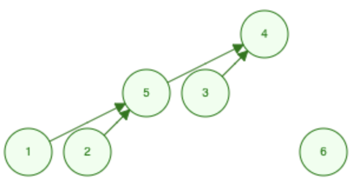
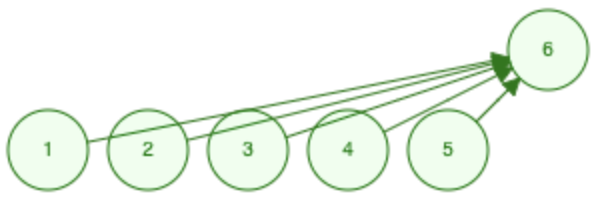
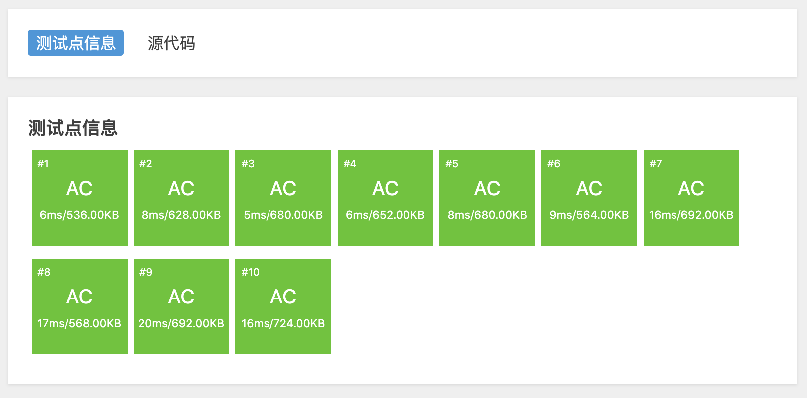

# 路径压缩模板

基础模板里，当查询某个节点的根节点时，要依次遍历父节点，直至根节点。最坏情况时树退化成链，每次执行需要 $O(n)$ 的时间复杂度，效率低下。

采用**路径压缩（Path Compression）**进行优化。路径压缩会在执行 `Find(x)` 函数时，将 `x` 到根节点的所有节点全部指向根。由于我们用的是代表元法，树的形态并不重要，路径压缩保证了同一棵树的根结点不变，但是树变得扁平，缩短下次查询时的查找路径。

## 例题

[「洛谷」P 1551 亲戚](https://www.luogu.com.cn/problem/P1551)。

## 分析

### 初始状态


给定 6 个人，一开始并不知道他们之间的关系，所以每个人都是一个单独的集合，每个集合的代表就是它自己。

### 合并

依次执行 `Union(1, 2)`，`Union(1, 5)`，`Union(3, 4)`，`Union(5, 2)` 之后得到：


执行 `Union(1, 3)` 之后：



执行 `Union(1, 3)` 时，需要先执行 `Find(1)` 和 `Find(3)`。

`1` 的关系网为：`1 -> 2 -> 5`。代码执行路径为 `Find(1) { p[1] = Find(2); } -> Find(2) { p[2] = Find(5); } -> Find(5) { return 5; }`。执行之后 `1` 的父节点由 `2` 更改为 `5`，将关系链变成 `1 -> 5`。这样下次再调用 `Find(1)` 时不需要再访问 `2`，压缩了路径。

思考一下，如果像基础模板里树退化成链之后，执行一次路径压缩版本的 `Find(1)` 会变成什么？

> 执行一次 `Find(1)` 之后，会得到如下结构：
>
> 
>
> 下次再调用 `Find(1)`，`Find(2)` 等时，只需跳一步就能抵达根节点。

## 代码

与基础模板的区别主要是 `Find(x)` 函数。

```cpp
#include <iostream>
#include <vector>

using namespace std;

class UnionFind {
   public:
    vector<int> parent;
    UnionFind(int n) {
        // 集合的代表元素 parent 数组
        parent.resize(n);
        // 初始时每个集合的代表元素就是自身
        for (int i = 0; i < n; ++i) {
            parent[i] = i;
        }
    }

    /* 查找 x 所在集合的代表元素，即父节点 */
    int Find(int x) {
        if (x != parent[x]) {
            // 非集合代表元素，在递归调用返回的时候，将沿途经过的结点指向根节点
            parent[x] = Find(parent[x]);
        }
        return parent[x];
    }

    /* 合并 x y 所在集合 */
    void Union(int x, int y) {
        // 先查找 x y 所在集合的代表元素
        int px = Find(x), py = Find(y);
        if (px != py) {
            // 不在同一个集合，将 x 所在集合合并到 y 所在集合
            parent[px] = py;
        }
    }
};

int main() {
    int n, m, p;
    cin >> n >> m >> p;

    UnionFind *uf = new UnionFind(n + 1);

    int mi, mj;
    for (int i = 0; i < m; ++i) {
        cin >> mi >> mj;
        uf->Union(mi, mj);
    }

    int pi, pj;
    for (int i = 0; i < p; ++i) {
        cin >> pi >> pj;
        int ppi = uf->Find(pi), ppj = uf->Find(pj);
        if (ppi == ppj) {
            cout << "Yes" << endl;
        } else {
            cout << "No" << endl;
        }
    }
}
```

评测结果：



## 注意

路径压缩只优化 `x` 节点到其根节点的路径，而 **`x` 子节点的路径不会被优化**。

## 时间复杂度

可以先比较下两个模板的评测结果，直观的感受下时间复杂度的变化。

理论上，执行 $m$ 次 `Find` 操作，$n-1$ 次 `Union` 操作的时间复杂度是 **$O(m \log n)$**，其中 $m \geq n $。

**Theorem.** *[Tarjan-van Leeuwen 1984]* Starting from an empty data structure, path compression (with naive linking) performs any intermixed sequence of $m \geq n$ find and $n-1$ union operations in $O(m \log n)$ time.[1]

## 引用

[1]：[R. Tarjan and J. van Leeuwen. Worst-case Analysis of Set Union Algorithms. J. ACM, Vol. 31, No. 2, April 1984, pp. 245-281.](https://www.researchgate.net/publication/220430653_Worst-case_Analysis_of_Set_Union_Algorithms)

