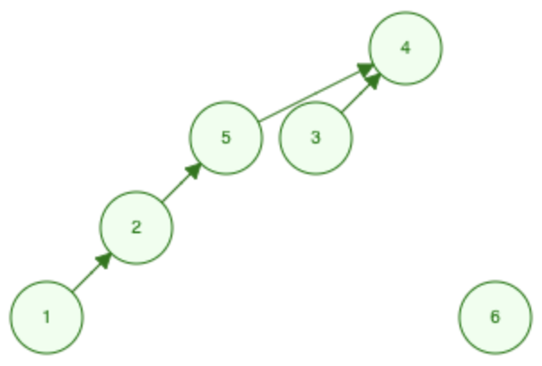
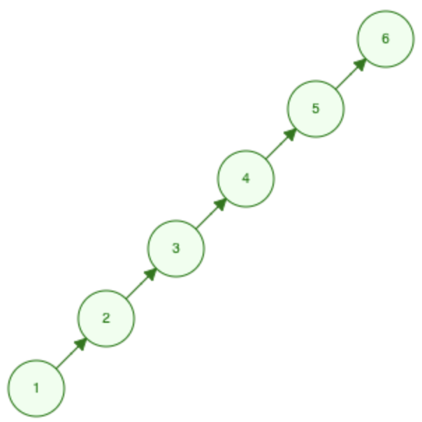

# 基础模板

## 例题

一道典型的并查集应用的题目：[「洛谷」P 1551 亲戚](https://www.luogu.com.cn/problem/P1551)。

> #### 题目背景
>
> 若某个家族人员过于庞大，要判断两个是否是亲戚，确实还很不容易，现在给出某个亲戚关系图，求任意给出的两个人是否具有亲戚关系。
>
> #### 题目描述
>
> 规定：`x` 和 `y` 是亲戚，`y` 和 `z` 是亲戚，那么 `x` 和 `z` 也是亲戚。如果 `x`，`y` 是亲戚，那么 `x` 的亲戚都是 `y` 的亲戚，`y` 的亲戚也都是 `x` 的亲戚。
>
> #### 输入格式
>
> 第一行：三个整数 `n`，`m`，`p`，（`n<=5000`，`m<=5000`，`p<=5000`），分别表示有 `n` 个人，`m` 个亲戚关系，询问 `p` 对亲戚关系。
>
> 以下 `m` 行：每行两个数 `Mi`，`Mj`，`1<=Mi`，`Mj<=N`，表示 `Mi` 和 `Mj` 具有亲戚关系。
>
> 接下来 `p` 行：每行两个数 `Pi`，`Pj`，询问 `Pi` 和 `Pj` 是否具有亲戚关系。
>
> #### 输入输出样例
>
> **输入 #1**
>
> ```
> 6 5 3
> 1 2
> 1 5
> 3 4
> 5 2
> 1 3
> 1 4
> 2 3
> 5 6
> ```
>
> **输出 #1**
>
> ```
> Yes
> Yes
> No
> ```

## 代码

先展示代码，细节分析在代码之后。

```cpp
#include <iostream>
#include <vector>

using namespace std;

class UnionFind {
   public:
    vector<int> p;
    UnionFind(int n) {
        // 集合的代表元素 parent 数组
        p = vector<int>(n, 0);
        // 初始时每个集合的代表元素就是自身
        for (int i = 0; i < n; ++i) {
            p[i] = i;
        }
    }

    int Find(int x) {
        /* 查找 x 所在集合的代表元素，即父节点 */
        if (x == p[x]) {
            // 节点的父节点就是自身，说明 x 就是集合的代表元素
            return x;
        } else {
            // 否则迭代查找父节点
            return Find(p[x]);
        }
    }

    void Union(int x, int y) {
        /* 合并 x y 所在集合 */
        // 查找 x y 所在集合的代表元素
        int px = Find(x), py = Find(y);
        if (px != py) {
            // 不在同一个集合，将 x 所在集合合并到 y 所在集合
            p[px] = py;
        }
    }
};

int main() {
    // freopen("1.txt", "r", stdin);
    int n, m, p;
    cin >> n >> m >> p;

    UnionFind *uf = new UnionFind(n + 1);

    int mi, mj;
    for (int i = 0; i < m; ++i) {
        cin >> mi >> mj;
        uf->Union(mi, mj);
    }

    int pi, pj;
    for (int i = 0; i < p; ++i) {
        cin >> pi >> pj;
        // 每个查询都要先找到集合的代表元素，然后判断
        int ppi = uf->Find(pi), ppj = uf->Find(pj);
        if (ppi == ppj) {
            cout << "Yes" << endl;
        } else {
            cout << "No" << endl;
        }
    }
}
```

评测结果：


## 分析

`Mi`，`Mj` 是亲戚关系代表可以合并 `Mi`，`Mj` 所在的集合。`Pi`，`Pj` 是否具有亲戚关系，只需判断他们是否在同一集合。

### 初始状态


给定 6 个人，一开始并不知道他们之间的关系，所以每个人都是一个单独的集合，每个集合的代表就是它自己。

### 合并

#### 亲戚关系：`1 2`

执行 `Union(1, 2)` 之后：


`1` 和 `2` 是亲戚关系，将他们合并为一个集合。合并之后，用 `2` 代表整个集合。

#### 亲戚关系：`1 5`

执行 `Union(1, 5)` 之后：


`1` 和 `5` 是亲戚关系，根据题意合并两人所在的集合。`1` 所在集合的代表是 `2`，合并之后用 `5` 代表整个集合。

#### 亲戚关系

依次对 `3 4`，`5 2`，`1 3` 进行合并之后得到如下的亲戚关系图：



### 查询

**`1 4`**：`Find(1)` 的结果是 `4`，`Find(4)` 的结果也是 `4`。他们属于同一个集合，所以输出 `Yes`。 **`2 3`**同理。

**`5 6`**：`Find(5)` 的结果是 `4`，`Find(6)` 的结果是 `6`。他们不属于同一个结合，所以输出 `No`。

## 时间复杂度

并查集的合并操作的主体是查找操作，所以只需要分析查找操作的时间复杂度。

最坏情况时，**树会退化成链**，例如当 `n=6` 时，执行如下操作：

1. `Union(1, 2)`
2. `Union(1, 3)`
3. `Union(1, 4)`
4. `Union(1, 5)`
5. `Union(1, 6)`

会得到如下结构：



每次查询节点 `1` 的时候都需要遍历整个「树」，所以时间复杂度是：**`O(n)`**，`n` 为节点数。

## 空间复杂度

空间复杂度：**`O(n)`**，`n` 为节点数。

## 引用

1. [可视化网址](https://www.cs.usfca.edu/~galles/JavascriptVisual/DisjointSets.html)